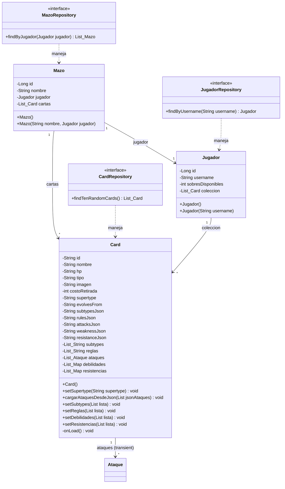
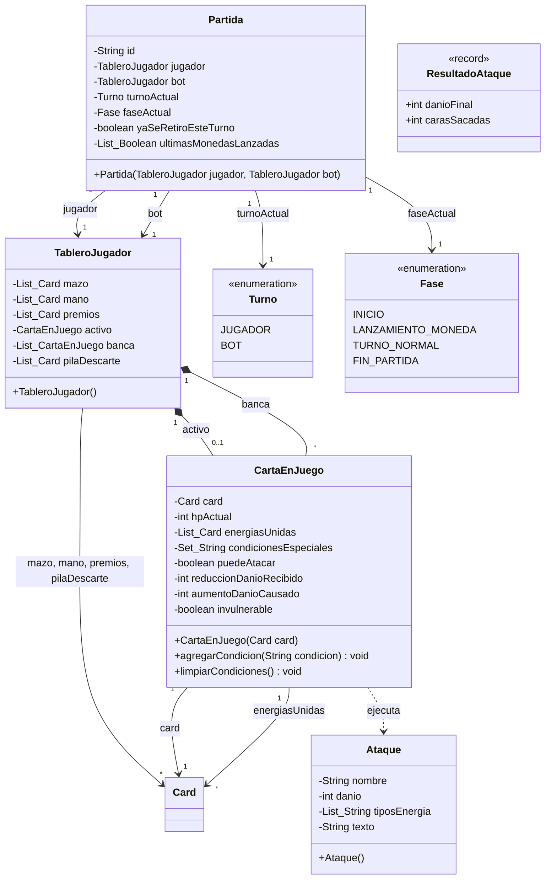
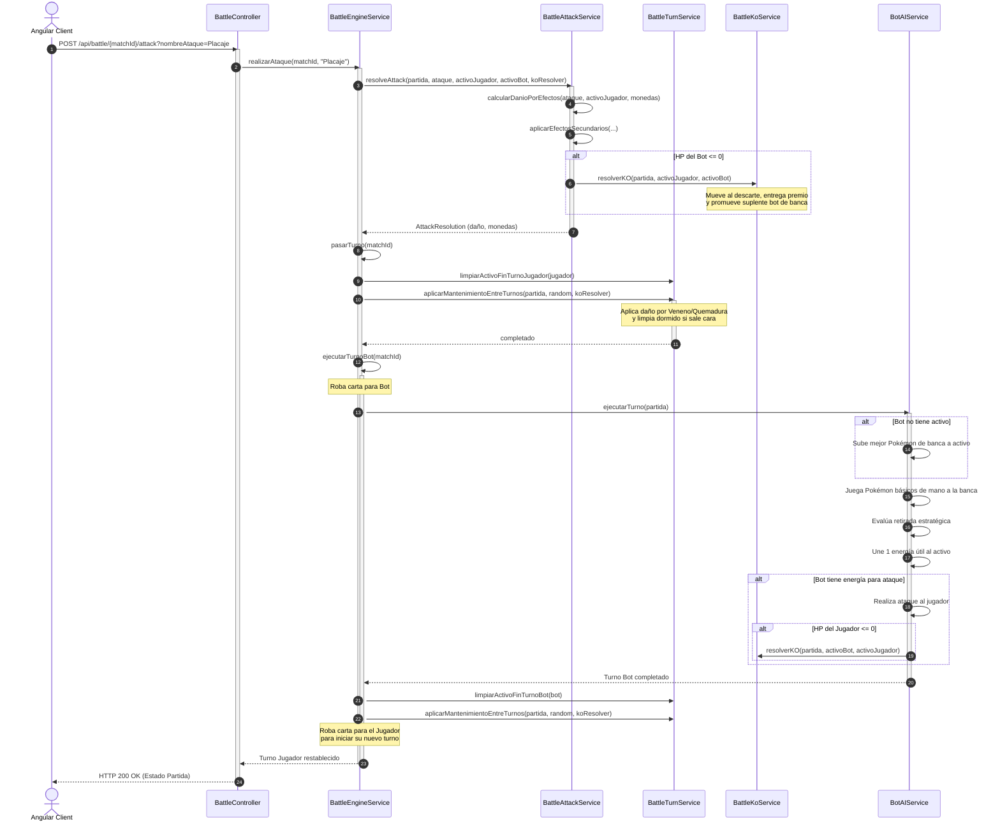

# Documentación de Arquitectura y UML del Backend - Pokémon TCG

Este documento proporciona un análisis exhaustivo y detallado de la arquitectura de software, los modelos de dominio, los patrones de diseño y las capas de negocio del backend de la aplicación **Pokémon Trading Card Game (TCG)**. Toda la documentación técnica está redactada en español.

---

## 1. Introducción a la Arquitectura del Sistema

El backend de esta aplicación de Pokémon TCG está desarrollado sobre el framework **Java Spring Boot**, siguiendo una arquitectura multicapa altamente desacoplada y orientada a dominios de negocio. El diseño promueve el cumplimiento de buenas prácticas de desarrollo de Spring, como la **inyección de dependencias basada en constructores** con campos declarados como `private final` y el **desacoplamiento mediante DTOs** (Data Transfer Objects).

El sistema se compone de dos grandes mundos diferenciados por su modelo de ciclo de vida:

1. **Dominio de Persistencia Relacional y Catálogo (Base de Datos H2)**:
   - Administrado a través de **Spring Data JPA** e Hibernate.
   - Utiliza una base de datos **H2 en memoria** que se recrea en cada arranque del servidor (`ddl-auto=update`).
   - El componente `DataLoader` actúa como hidratador inicial del catálogo de cartas leyendo un archivo `cards.json` y creando un usuario de prueba llamado `Pablo` con un mazo preconfigurado y una colección inicial de cartas.
   - Cuenta con persistencia híbrida. Por ejemplo, en la entidad `Card`, los atributos estructurados y dinámicos (ataques, debilidades, resistencias, reglas y subtipos) se almacenan en formato JSON plano (`attacksJson`, etc.) en la base de datos para mantener un esquema relacional limpio y se deserializan automáticamente a objetos Java con Jackson mediante `@PostLoad`.

2. **Dominio de Simulación de Combates (En Memoria)**:
   - La lógica de batalla, turnos, simulación de Inteligencia Artificial (Bot) y cálculo de ataques corre **completamente en memoria** dentro del servicio `BattleEngineService`.
   - Se gestiona mediante un mapa concurrente (`ConcurrentHashMap`) asociando partidas activas mapeadas por un identificador único global `UUID` (`matchId`).
   - Este enfoque elimina la latencia de persistencia de base de datos para acciones rápidas de juego por turnos (como lanzar monedas, promover activos, unir energías o atacar) y mantiene un estado limpio en tiempo de ejecución.

---

## 2. Diagrama de Arquitectura de Alto Nivel

El siguiente diagrama de flujo conceptual muestra la conexión entre los módulos y las capas del backend, desde los controladores REST expuestos al cliente frontend (Angular) hasta el motor en memoria y la persistencia relacional:

```mermaid
flowchart TD
    subgraph Cliente ["Cliente Frontend (Angular)"]
        UI["Interfaz de Usuario (localhost:4200)"]
    end

    subgraph CapaAPI ["Controladores REST (Capa de API)"]
        AuthController["AuthController"]
        JugadorController["JugadorController"]
        CardController["CardController"]
        MazoController["MazoController"]
        SobreController["SobreController"]
        BattleController["BattleController"]
    end

    subgraph CapaService ["Capa de Servicios / Negocio"]
        AuthService["AuthService"]
        SobreService["SobreService"]
        MazoService["MazoService"]
        BattleService["BattleService"]
        
        subgraph MotorJuego ["Motor de Batalla (En Memoria)"]
            BattleEngineService["BattleEngineService"]
            BattleAttackService["BattleAttackService"]
            BattleKoService["BattleKoService"]
            BattleTurnService["BattleTurnService"]
            BotAIService["BotAIService"]
        end
    end

    subgraph CapaRepo ["Capa de Persistencia (JPA Repositories)"]
        JugadorRepository["JugadorRepository"]
        CardRepository["CardRepository"]
        MazoRepository["MazoRepository"]
    end

    subgraph Modelos ["Modelos y Entidades"]
        subgraph EntidadesJPA ["Entidades Persistentes (H2)"]
            Jugador["Jugador"]
            Mazo["Mazo"]
            Card["Card"]
        end

        subgraph ModelosEnMemoria ["Entidades de Juego en Memoria"]
            Partida["Partida"]
            TableroJugador["TableroJugador"]
            CartaEnJuego["CartaEnJuego"]
            Ataque["Ataque"]
            ResultadoAtaque["ResultadoAtaque (Record)"]
        end
    end

    UI <--> |HTTP Requests / DTOs| CapaAPI
    
    %% Flujos de llamada
    AuthController --> AuthService
    JugadorController --> JugadorRepository
    CardController --> CardRepository
    MazoController --> MazoService
    SobreController --> SobreService
    BattleController --> BattleEngineService

    MazoService --> MazoRepository
    MazoService --> JugadorRepository
    MazoService --> CardRepository
    SobreService --> JugadorRepository
    SobreService --> CardRepository
    AuthService --> JugadorRepository
    BattleService --> JugadorRepository

    BattleEngineService --> BotAIService
    BattleEngineService --> BattleTurnService
    BattleEngineService --> BattleAttackService
    BattleEngineService --> BattleKoService

    %% Relación con persistencia y memoria
    JugadorRepository -.-> Jugador
    CardRepository -.-> Card
    MazoRepository -.-> Mazo

    BattleEngineService --> Partida
    Partida --> TableroJugador
    TableroJugador *-- CartaEnJuego
    CartaEnJuego --> Card
    CartaEnJuego *-- Ataque
```

---

## 3. Diagramas de Clases de los Dominios Detallados

A continuación, se dividen los diagramas de clases en secciones lógicas utilizando sintaxis limpia de **Mermaid.js**, evitando caracteres especiales incompatibles con las reglas de compilación para garantizar la validez del diagrama.

### 3.1 Dominio de Persistencia y Modelos Principales (Entidades JPA)

Este módulo gestiona la persistencia de las cartas del catálogo, la información de perfil de los jugadores, sus colecciones completas de cartas y los mazos de 60 cartas creados por los mismos.



---

### 3.2 Dominio del Motor de Batalla (Modelos en Memoria)

Estos modelos estructuran el estado dinámico de un combate activo entre un jugador humano y el bot controlado por IA. No se persisten y solo viven mientras la partida se encuentre en curso.



---

### 3.3 Servicios y Lógica de Negocio (Services)

Representa la capa encargada de toda la computación del negocio. Se resalta la separación detallada de responsabilidades del motor de batalla (`BattleEngineService`) delegando en servicios específicos y previniendo referencias circulares mediante inyección pura de dependencias.

```mermaid
classDiagram
    class BattleEngineService {
        -JugadorRepository jugadorRepo
        -MazoRepository mazoRepo
        -CardRepository cardRepo
        -Random random
        -Map_String_Partida partidasEnCurso
        -BotAIService botAIService
        -BattleTurnService battleTurnService
        -BattleAttackService battleAttackService
        -BattleKoService battleKoService
        +BattleEngineService(JugadorRepository, MazoRepository, CardRepository, BotAIService, BattleTurnService, BattleAttackService, BattleKoService)
        +startBattle(String username, Long mazoId) Partida
        +lanzarMoneda(String matchId) boolean
        +elegirTurno(String matchId, boolean vaPrimero) void
        +getEstadoPartida(String matchId) Partida
        +jugarPokemon(String matchId, String cartaId) void
        +unirEnergia(String matchId, String cartaId, String energiaId) void
        +realizarRetirada(String matchId, String nuevoActivoId) void
        +subirAActivoDesdeBanca(String matchId, String cartaIdEnBanca) void
        +realizarAtaque(String matchId, String nombreAtaqueElegido) void
        +pasarTurno(String matchId) void
        +ejecutarTurnoBot(String matchId) void
        +evolucionarPokemon(String matchId, String cartaManoId, String cartaTableroId) void
        +debugRobarCarta(String matchId, String cardId) Partida
        +debugForzarEstado(String matchId, String objetivo, String estado) Partida
        +debugSetHp(String matchId, String objetivo, int hp) Partida
        +obtenerCatalogoCartasDebug() List_Card
    }

    class BattleAttackService {
        -Random random
        +resolveAttack(Partida partida, Ataque ataque, CartaEnJuego atacante, CartaEnJuego defensor, KoResolver koResolver) AttackResolution
        -calcularDanioPorEfectos(Ataque ataque, CartaEnJuego atacante, List_Boolean historialMonedas) ResultadoAtaque
        -aplicarEfectosSecundarios(Partida partida, Ataque ataque, CartaEnJuego atacante, CartaEnJuego defensor, int carasSacadas, List_Boolean historialMonedas, KoResolver koResolver) void
    }

    class BattleKoService {
        +resolverKO(Partida partida, CartaEnJuego atacante, CartaEnJuego defensor) void
        -identificarTableros(Partida partida, CartaEnJuego defensor, CartaEnJuego atacante) TableroVictimaYAtacante
        -encontrarTableroPorCarta(Partida partida, CartaEnJuego carta) TableroJugador
        -elegirMejorReemplazoBot(TableroJugador tableroBot, CartaEnJuego activoRival) CartaEnJuego
        -calcularPuntajeEstrategico(CartaEnJuego candidato, CartaEnJuego rival) int
    }

    class BattleTurnService {
        +limpiarActivoFinTurnoJugador(TableroJugador jugador) void
        +limpiarActivoFinTurnoBot(TableroJugador bot) void
        +aplicarMantenimientoEntreTurnos(Partida partida, Random random, KoResolver koResolver) void
        -procesarEstado(TableroJugador dueno, TableroJugador rival, Partida partida, Random random, KoResolver koResolver) void
    }

    class BotAIService {
        -Random random
        +ejecutarTurno(Partida partida) void
        -evaluarRetiradaEstrategica(TableroJugador bot, TableroJugador jugador, Partida partida) void
        -ejecutarRetirada(TableroJugador bot, CartaEnJuego suplente, int costo, Partida partida) void
        -calcularAmenazaMaxima(CartaEnJuego atacanteRival, CartaEnJuego miDefensor) int
        -gestionarCartasEnMano(TableroJugador tablero, Partida partida) void
        -evaluarPotencialDeMano(Card pokemon, List_Card energiasEnMano, CartaEnJuego activoRival) int
        -pokemonNecesitaEsteTipo(CartaEnJuego pokemon, Card energia) boolean
        -gestionarEnergiaBot(TableroJugador tablero) void
        -puedePagarCosto(CartaEnJuego pokemon, Ataque ataque) boolean
        -normalizarTipo(String texto) String
        -intentarAtacar(TableroJugador tableroBot, Partida partida) void
        -calcularDanioFinal(CartaEnJuego atacante, CartaEnJuego defensor, Ataque ataque) int
    }

    class SobreService {
        -JugadorRepository jugadorRepo
        -CardRepository cardRepo
        -Random random
        +SobreService(JugadorRepository, CardRepository)
        +abrirSobre(String username) List_Card
    }

    class MazoService {
        -MazoRepository mazoRepo
        -JugadorRepository jugadorRepo
        -CardRepository cardRepo
        +MazoService(MazoRepository, JugadorRepository, CardRepository)
        +guardarMazo(String nombre, String username, List_String cartaIds) Mazo
        +actualizarMazo(Long id, String nombre, List_String cartasIds) Mazo
        +listarMazos(String username) List_Mazo
        +debugInyectarCarta(Long mazoId, String cartaId, String cartaAReemplazarId) Mazo
    }

    class AuthService {
        -JugadorRepository jugadorRepo
        +AuthService(JugadorRepository)
        +login(String username) Jugador
    }

    class BattleService {
        -JugadorRepository jugadorRepo
        +BattleService(JugadorRepository)
        +startBattle(String username, Long mazoId) Partida
        +robarCartas(TableroJugador tablero, int cantidad) void
        +tienePokemonBasico(TableroJugador tablero) boolean
        +realizarMulligan(TableroJugador tablero) void
        +bajarAPrimerBanca(TableroJugador tablero, Card carta) void
    }

    BattleEngineService --> BotAIService
    BattleEngineService --> BattleTurnService
    BattleEngineService --> BattleAttackService
    BattleEngineService --> BattleKoService
    
    BattleEngineService ..> Partida : gestiona
    BotAIService ..> Partida : toma decisiones en
    BattleAttackService ..> Partida : aplica ataques en
    BattleKoService ..> Partida : resuelve K.O. en
    BattleTurnService ..> Partida : mantiene turnos en
```



---

### 3.4 Controladores y Puntos de Entrada HTTP (Controllers)

Esta capa gestiona los endpoints expuestos que consumen la interfaz web.

```mermaid
classDiagram
    class BattleController {
        -BattleEngineService battleEngine
        +BattleController(BattleEngineService)
        +startBattle(String username, StartBattleRequest request) ResponseEntity
        +getEstadoPartida(String matchId) ResponseEntity
        +evolucionarPokemon(String matchId, EvolveRequest request) ResponseEntity
        +jugarBot(String matchId) ResponseEntity
        +lanzarMoneda(String matchId) ResponseEntity
        +elegirTurno(String matchId, ChooseTurnRequest request) ResponseEntity
        +jugarPokemon(String matchId, JugarPokemonRequest request) ResponseEntity
        +unirEnergia(String matchId, UnirEnergiaRequest request) ResponseEntity
        +atacar(String matchId, String nombreAtaque) ResponseEntity
        +promoteToActive(String matchId, String cartaId) ResponseEntity
        +pasarTurno(String matchId) ResponseEntity
        +retirarPokemon(String matchId, String nuevoActivoId) ResponseEntity
        +debugDrawCard(String matchId, Map payload) ResponseEntity
        +debugForzarEstado(String matchId, Map payload) ResponseEntity
        +debugSetHp(String matchId, Map payload) ResponseEntity
        +getCatalogoDebug() ResponseEntity
    }

    class AuthController {
        -AuthService authService
        +AuthController(AuthService)
        +login(LoginRequest request) ResponseEntity
    }

    class JugadorController {
        -JugadorRepository jugadorRepo
        +JugadorController(JugadorRepository)
        +obtenerDatos(String username) ResponseEntity
        +obtenerColeccion(String username) ResponseEntity
        +debugSetSobres(String username, DebugSetSobresRequest request) ResponseEntity
    }

    class MazoController {
        -MazoService mazoService
        +MazoController(MazoService)
        +guardarMazo(GuardarMazoRequest request) ResponseEntity
        +listarMazos(String username) ResponseEntity
        +actualizarMazo(Long id, ActualizarMazoRequest request) ResponseEntity
        +debugInyectarCarta(Long id, DebugInjectCardRequest request) ResponseEntity
    }

    class SobreController {
        -SobreService sobreService
        +SobreController(SobreService)
        +abrirSobre(String username) ResponseEntity
    }

    class CardController {
        -CardRepository cardRepo
        +CardController(CardRepository)
        +getAll() ResponseEntity
    }

    BattleController --> BattleEngineService
    AuthController --> AuthService
    JugadorController --> JugadorRepository
    MazoController --> MazoService
    SobreController --> SobreService
    CardController --> CardRepository
```



---

## 4. Descripción Detallada de Clases y Responsabilidades

### 4.1 Capa de Modelos y Entidades

- **`Card`**: Representa la definición base de una carta física del juego (Pokémon o Energía). Tiene atributos estáticos mapeados por JPA a la tabla `cards` (`id`, `nombre`, `hp`, `tipo`, `imagen`, `costoRetirada`, `supertype`, `evolvesFrom`). Posee un mecanismo de persistencia híbrida: los datos dinámicos altamente aninados como `attacksJson` o `weaknessJson` se guardan serializados en texto y se deserializan automáticamente a objetos Java con Jackson mediante `@PostLoad` al recuperarse de la BD a listas transient (como `ataques` de tipo `Ataque`).
- **`Jugador`**: Entidad JPA para almacenar los perfiles persistentes en la tabla `jugadores`. Es el dueño de su `username`, sus `sobresDisponibles` (por defecto 10 al crearse) y su `coleccion` de cartas ganadas (relación `@ManyToMany` con carga `FetchType.EAGER`).
- **`Mazo`**: Entidad JPA mapeada a la tabla `mazos`. Representa un mazo construido. Posee una relación `@ManyToOne` con `Jugador` y una relación `@ManyToMany` con `Card` (`cartas`). Su regla de negocio primordial obliga a contener exactamente 60 cartas.
- **`Partida`**: Clase central contenedora de la batalla en memoria. Almacena el `id` único de la partida (`UUID`), las referencias a los tableros de ambos contendientes (`jugador` y `bot`), el estado del `turnoActual` (`JUGADOR` o `BOT`), la `faseActual` (`INICIO`, `LANZAMIENTO_MONEDA`, `TURNO_NORMAL`, `FIN_PARTIDA`), si el jugador ya realizó una retirada en el turno actual, y el historial lógico de las últimas monedas tiradas.
- **`TableroJugador`**: Modela las zonas lógicas de juego en una partida para uno de los competidores: `mazo` (oculto barajado), `mano` (lista privada), `premios` (lista oculta inicial de 6 cartas), `activo` (referencia a la `CartaEnJuego` en combate), `banca` (lista de hasta 5 `CartaEnJuego`), y `pilaDescarte`.
- **`CartaEnJuego`**: Decorador que almacena el estado dinámico y mutable de una carta mientras está en el tablero. Contiene una referencia inmutable a la `Card` base, su `hpActual` modificado por ataques recibidos, la lista de cartas de tipo energía asociadas (`energiasUnidas`), sus condiciones especiales acumuladas (`Set` de estados: `Asleep`, `Paralyzed`, `Poisoned`, `Burned`, `Confused`, `CantRetreat`), si puede atacar, modificaciones temporales de daño y si es invulnerable por algún efecto de escudo temporal.
- **`Ataque`**: Representa un ataque de un Pokémon. Contiene atributos como su `nombre`, `danio` base, `tiposEnergia` requeridos y el `texto` explicativo que interpretará el motor.
- **`ResultadoAtaque`**: Estructura `record` inmutable que devuelve el daño final calculado (después de aplicar multiplicadores por efectos, debilidades o resistencias) y la cantidad de caras de moneda obtenidas en las tiradas aleatorias del ataque.

### 4.2 Capa de Servicios (Lógica de Negocio)

- **`BattleEngineService`**: Orquestador en memoria del flujo completo del juego. Expone operaciones controladas para iniciar batallas, validar y bajar Pokémon básicos, unir energías, aplicar retiradas pagando su costo energético, verificar evoluciones (validando que una carta evolucione exactamente de su pre-evolución y arrastrando el daño pero limpiando estados alterados) y realizar ataques. Coordina los subsistemas para la IA y mantenimiento de la partida activa en su mapa concurrente.
- **`BattleAttackService`**: Especialista en la resolución física de ataques. Interpreta las reglas complejas escritas en el texto del ataque utilizando análisis heurístico basado en expresiones de cadena (ej: curaciones, daño colateral a banca, daño auto-infringido por retroceso, descarte de energías propias o del defensor, estados alterados condicionados a tiradas de monedas, y ataques multiplicados por la cantidad de energías unidas). Lanza las monedas aleatorias requeridas e inflige daño al HP actual del defensor.
- **`BattleKoService`**: Centraliza la lógica reactiva en caso de que un Pokémon caiga a 0 HP (K.O.). Mueve la carta a la `pilaDescarte`, remueve la referencia del activo o la banca del tablero perdedor, roba una carta de la zona de `premios` para el ganador, evalúa si se cumple alguna de las condiciones de victoria de la partida (premios agotados o jugador sin Pokémon en mesa) y activa la heurística de reemplazo inteligente del Bot en caso de que el Bot deba promover un Pokémon suplente de su banca al puesto activo.
- **`BattleTurnService`**: Gestiona el mantenimiento entre turnos. Limpia los estados de parálisis y bloqueos de retirada temporales y procesa la aplicación de daño por Veneno (10 HP de daño), Quemadura (20 HP de daño y tirada de moneda para curarse) y Dormido (tirada de moneda para despertarse).
- **`BotAIService`**: El cerebro de la Inteligencia Artificial enemiga. Toma decisiones en orden estructurado en el turno del bot: asegura tener un Pokémon activo promoviendo el suplente con mayor HP si se debilitó el anterior; analiza si le conviene retirarse tácticamente si está en peligro inminente de K.O., estancado o sufriendo veneno; juega cartas básicas de la mano priorizando las que tienen mayor sinergia de counter contra el activo del rival; une cartas de energía a sus cartas basándose en qué ataques puede completar para el turno; e intenta atacar con el primer ataque que tenga cargado con suficiente energía.
- **`SobreService`**: Lógica de apertura de sobres. Descuenta un sobre disponible al jugador y genera 10 cartas aleatorias (entre 2 y 5 energías y el resto Pokémon) agregándolas a su colección permanente.
- **`MazoService`**: Encargado de la persistencia de mazos. Permite guardar, actualizar y listar mazos validados de 60 cartas. Cuenta con funciones específicas de debug (God Mode) para inyectar cartas al mazo reemplazando cartas existentes para pruebas controladas.
- **`AuthService`**: Login rudimentario sin tokens ni contraseñas. Si el usuario existe en base, lo recupera; de lo contrario, registra un nuevo `Jugador` con 10 sobres de regalo.

### 4.3 Capa de Repositorios y Acceso a Datos

- **`CardRepository`**: Interfaz de Spring Data JPA. Incluye el método `findTenRandomCards()` que utiliza consultas nativas de H2 (`SELECT * FROM cards ORDER BY RAND() LIMIT 10`) para generar sobres rápidos.
- **`JugadorRepository`**: Interfaz de Spring Data JPA. Define `findByUsername(String username)` usando un query parametrizado con `LEFT JOIN FETCH j.coleccion` para prevenir consultas adicionales y el problema de consultas N+1 en Hibernate al traer al jugador junto con sus cartas en una sola llamada a base de datos.
- **`MazoRepository`**: Interfaz JPA para persistir mazos. Permite listar todos los mazos pertenecientes a una entidad `Jugador`.

---

## 5. Descubrimientos y Patrones de Arquitectura Clave

### 5.1 Hidratación Híbrida mediante `@PostLoad` y `@JsonProperty`
Para evitar un esquema relacional con decenas de tablas asociativas complejas que ralentizarían el arranque del sistema (dado que el JSON de origen `cards.json` contiene estructuras muy profundas con ataques y debilidades), el backend emplea un patrón híbrido.
Al guardar cartas en H2, campos dinámicos como los ataques se almacenan serializados como un String plano en formato JSON (`attacksJson`). La clase `Card` utiliza un método `@PostLoad` denominado `onLoad()`. Hibernate dispara este método automáticamente después de recuperar una carta de la base de datos, y a través de un `ObjectMapper` deserializa el JSON a listas transient fuertemente tipadas en memoria. Esto permite al motor de batalla acceder inmediatamente a objetos estructurados e inmutables sin penalizaciones en la complejidad de base de datos.

### 5.2 Desacoplamiento de K.O.s mediante la Interfaz Funcional `KoResolver`
Para evitar el acoplamiento circular fuerte y bidireccional entre el motor de combate central (`BattleEngineService`), el resolvedor de ataques (`BattleAttackService`), y el resolvedor de turnos (`BattleTurnService`), se implementó un diseño desacoplado usando interfaces funcionales.
Tanto `BattleAttackService` como `BattleTurnService` definen interfaces funcionales locales `@FunctionalInterface public interface KoResolver`. En lugar de inyectar el servicio completo de K.O. en cada uno de estos servicios periféricos, el servicio orquestador principal (`BattleEngineService`) inyecta `BattleKoService` y, al llamar a las resoluciones de ataques y mantenimientos, pasa una referencia al método mediante lambdas de Java (`battleKoService::resolverKO`). De esta forma, los servicios de ataque y turnos aplican daño y, si detectan que el HP cae a 0, disparan el K.O. de forma totalmente desacoplada.

### 5.3 Heurística de counter-picking y ponderación de pesos de la IA
El Bot no toma decisiones aleatorias, sino que implementa una heurística estratégica en tiempo real calculando puntajes de potencial:
- Al promover un suplente tras un K.O., pondera a los candidatos de su banca asignando un valor estratégico: suma puntaje por energías asociadas (+50 por energía), HP restante, y resta puntos de forma masiva (-1000) si es débil al tipo de Pokémon activo del jugador humano, o suma puntos si tiene resistencia (+300) o si tiene counter-type ofensivo (+500).
- Al jugar cartas básicas de su mano, evalúa la "Sinergia de Energía" (si tiene en la mano la energía que el Pokémon requiere, suma +100 puntos), y prioriza bajar Pokémon que tengan ventaja de tipo directa contra el activo del jugador.

---

## 6. Diagrama de Secuencia de un Turno de Combate (Jugador Humano)

El siguiente diagrama detalla la secuencia lógica de eventos y las interacciones entre los componentes cuando el jugador realiza una acción clave (como atacar) y luego pasa su turno, lo que desencadena de forma inmediata el mantenimiento de estados alterados y el turno automático de la Inteligencia Artificial (Bot):



---

## 7. Glosario de Términos de Dominio (TCG)

Para facilitar el mantenimiento del backend por otros desarrolladores, se describe el mapeo de términos del juego:

1. **Pokémon Activo (`activo`)**: El Pokémon que se encuentra en la posición de combate. Es el único que puede declarar ataques y es el objetivo primario de los ataques del oponente.
2. **Banca (`banca`)**: Espacio de reserva en el tablero donde se pueden colocar hasta 5 Pokémon básicos. No pueden atacar directamente a menos que un ataque especifique daño a la banca.
3. **Mulligan (`realizarMulligan`)**: Regla de inicio del juego. Si la mano inicial de 7 cartas no tiene ningún Pokémon básico, se debe barajar y robar 7 nuevas cartas para evitar empezar la partida bloqueado.
4. **Cartas de Premio (`premios`)**: Lista de 6 cartas separadas al inicio de la partida. Cada vez que un Pokémon rival queda K.O., el jugador toma un premio y lo añade a su mano. Quien tome sus 6 cartas de premio primero, gana la partida.
5. **Retirada (`realizarRetirada`)**: Acción por la cual el Pokémon activo se mueve a la banca voluntariamente pagando un costo de retirada (descartando cartas de energía unidas a él iguales a su `costoRetirada`). Solo se permite una retirada por turno.
6. **Evolución (`evolucionarPokemon`)**: Colocar un Pokémon Fase 1 o 2 encima de su Pokémon básico correspondiente. Se hereda el daño acumulado pero se remueven todas las condiciones especiales.
