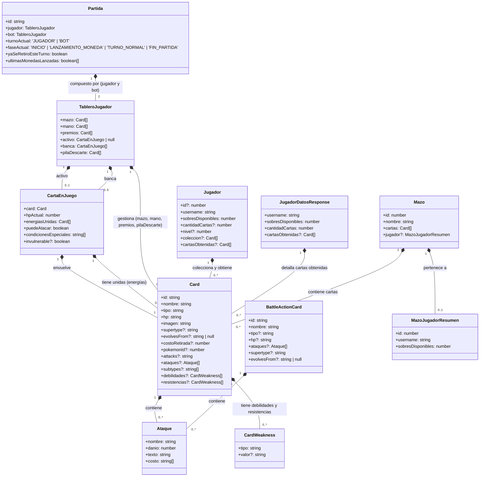
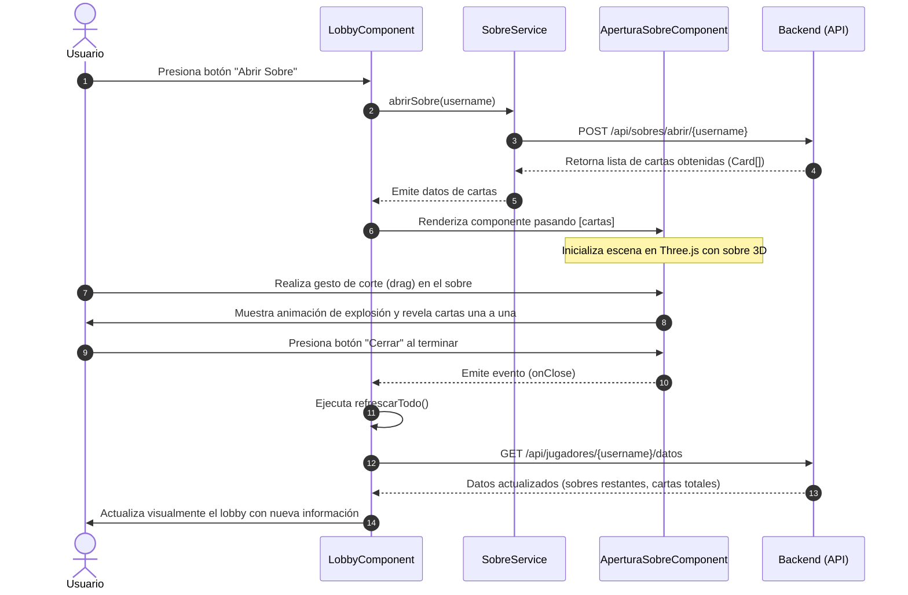
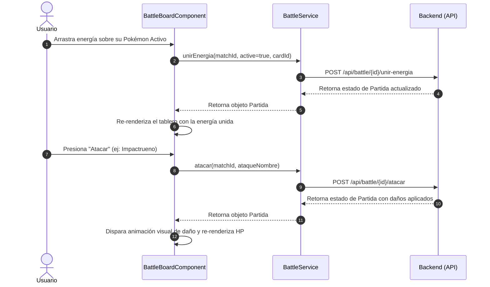

# Documentación UML del Proyecto Frontend - PokemonTCG

Este documento presenta la arquitectura, clases (interfaces de modelos), servicios y componentes del frontend de la aplicación **PokemonTCG** mediante diagramas UML utilizando **Mermaid**.

---

## 1. Diagrama de Clases (Modelos de Datos)

En Angular/TypeScript, los modelos de datos de este proyecto están definidos mediante interfaces. A continuación se presenta el diagrama de clases UML que detalla cada modelo, sus atributos, tipos y cómo se relacionan entre sí.

### Explicación de Relaciones en los Modelos:
- **Card, Ataque y CardWeakness:** Una carta (`Card`) posee una relación de composición de 0 a muchos ataques (`Ataque`) y debilidades/resistencias (`CardWeakness`).
- **CartaEnJuego:** Envuelve una instancia de `Card` y le añade estados dinámicos del campo (como `hpActual`, `condicionesEspeciales` y las energías asociadas en `energiasUnidas`).
- **TableroJugador:** Agrupa todas las zonas de cartas de un jugador en la partida (mazo, mano, premios, pila de descarte, activo y la banca que puede tener hasta 5 cartas en juego).
- **Partida:** La estructura maestra que contiene dos tableros (el del `jugador` real y el del `bot` rival) y coordina fases de juego y turnos.
- **Mazo:** Relaciona una colección de 60 cartas y contiene información resumida del jugador propietario.

---

## 2. Diagrama de Componentes y Servicios

Este diagrama ilustra la arquitectura de Angular mostrando cómo los componentes de la interfaz de usuario se comunican con los servicios de lógica de negocio y consumo de la API REST del backend.

```mermaid
classDiagram
    direction TB
    
    %% Componentes
    class App {
        <<Component>>
        +router-outlet
    }
    
    class LoginComponent {
        <<Component>>
        +username: string
        +onSubmit()
    }
    
    class LobbyComponent {
        <<Component>>
        +jugador: JugadorDatosResponse
        +mazos: Mazo[]
        +sobresParaAbrir: number
        +refrescarTodo()
        +abrirSobres()
        +finalizarApertura()
        +irAlDeckBuilder()
        +buscarPartida(mazoId: number)
    }
    
    class DeckBuilderComponent {
        <<Component>>
        +coleccion: Card[]
        +mazoActual: Card[]
        +idMazoAEditar: number
        +agregarAlMazo(carta: Card)
        +quitarDelMazo(carta: Card)
        +guardar()
    }
    
    class BattleBoardComponent {
        <<Component>>
        +partida: Partida
        +matchId: string
        +jugarCarta(carta: Card)
        +realizarAccion(ataque: Ataque)
        +pasarTurno()
        +retirarse()
    }
    
    class AperturaSobreComponent {
        <<Component>>
        +cartas: Card[]
        +onClose: EventEmitter
        +inicializarThreeJS()
        +animarSobre()
    }

    %% Servicios
    class AuthService {
        <<Service>>
        +login(username: string) Observable
    }

    class JugadorService {
        <<Service>>
        +getDatos(username: string) Observable
        +getColeccion(username: string) Observable
    }

    class SobreService {
        <<Service>>
        +abrirSobre(username: string) Observable
    }

    class MazoService {
        <<Service>>
        +listarMazos(username: string) Observable
        +guardarMazo(mazo: Mazo) Observable
        +actualizarMazo(id: number, mazo: Mazo) Observable
    }

    class BattleService {
        <<Service>>
        +iniciarBatalla(username: string, mazoId: number) Observable
        +getState(matchId: string) Observable
        +jugarPokemon(matchId: string, cardId: string) Observable
        +unirEnergia(matchId: string, active: boolean, cardId: string) Observable
        +atacar(matchId: string, ataqueNombre: string) Observable
        +pasarTurno(matchId: string) Observable
    }

    class BattleBoardUiService {
        <<Service>>
        +resolverSprites(cardName: string)
        +calcularHpPercentage(actual: number, max: number)
        +extraerGlosario(text: string)
    }

    class BattleBoardAttackService {
        <<Service>>
        +detectarAtaqueConMoneda(ataque: Ataque)
        +puedePagarAtaque(carta: CartaEnJuego, ataque: Ataque)
    }

    %% Relaciones de Dependencia e Inyección
    App ..> LoginComponent : navega a
    App ..> LobbyComponent : navega a
    App ..> DeckBuilderComponent : navega a
    App ..> BattleBoardComponent : navega a

    LoginComponent ..> AuthService : inyecta/consume
    
    LobbyComponent ..> JugadorService : inyecta/consume
    LobbyComponent ..> MazoService : inyecta/consume
    LobbyComponent ..> SobreService : inyecta/consume
    LobbyComponent ..> BattleService : inyecta/consume
    LobbyComponent *-- AperturaSobreComponent : aloja componente hijo

    DeckBuilderComponent ..> JugadorService : inyecta/consume
    DeckBuilderComponent ..> MazoService : inyecta/consume

    BattleBoardComponent ..> BattleService : inyecta/consume
    BattleBoardComponent ..> BattleBoardUiService : inyecta/consume
    BattleBoardComponent ..> BattleBoardAttackService : inyecta/consume
```

### Explicación de la Arquitectura:
- **`App` (Componente Raíz):** Actúa únicamente como contenedor a través de su `<router-outlet>`, delegando la navegación a las diferentes pantallas según la ruta activa.
- **Inyección de Dependencia Angular:** Los servicios se marcan con `@Injectable({ providedIn: 'root' })` y son consumidos por los componentes. Por ejemplo, `BattleBoardComponent` depende de tres servicios independientes para separar la lógica de peticiones HTTP (`BattleService`), lógica de visualización y sprites (`BattleBoardUiService`), y lógica matemática de costes de ataque (`BattleBoardAttackService`).
- **Anidación de Componentes:** El `LobbyComponent` actúa como contenedor directo de `AperturaSobreComponent` (el componente 3D con Three.js), comunicándose mediante enlace bidireccional (Inputs de cartas y Outputs de eventos al cerrar).

---

## 3. Diagrama de Secuencia de Apertura de Sobres (Flujo Dinámico)

Este diagrama muestra cómo interactúan el usuario, el componente principal del Lobby, el servicio de sobres, el componente de renderizado 3D y la API del Backend al realizar una apertura de sobres.

---

## 4. Diagrama de Secuencia del Turno de Batalla

Muestra el flujo de comunicación sincrónica con el backend para mantener el estado del juego actualizado en cada acción realizada.

---

## 5. Resumen de Flujos de Información en la Aplicación

1. **Autenticación (Login):**
   - El usuario introduce su `username` en `LoginComponent`.
   - `AuthService` hace un POST a `/api/auth/login`.
   - Si tiene éxito, se guarda el `username` en `localStorage` y se redirige a `/lobby`.
2. **Navegación y carga en Lobby:**
   - `LobbyComponent` lee `localStorage`. Si está vacío, redirige al Login.
   - Pide los datos de colección y resumen del jugador a través de `JugadorService` y `MazoService`.
3. **Editor de Mazos (Deck Builder):**
   - Carga la colección y permite agrupar exactamente 60 cartas respetando el stock y límite de 4 copias máximas por carta idéntica.
   - Guarda o actualiza a través de `MazoService` que consume `/api/mazos/guardar` o `/api/mazos/actualizar/{id}`.
4. **Batalla en Tablero (Battle Board):**
   - Obtiene el ID de partida de la ruta de navegación.
   - Realiza un polling y peticiones de acción mediante `BattleService` que devuelve el estado integral del combate (`Partida`).
