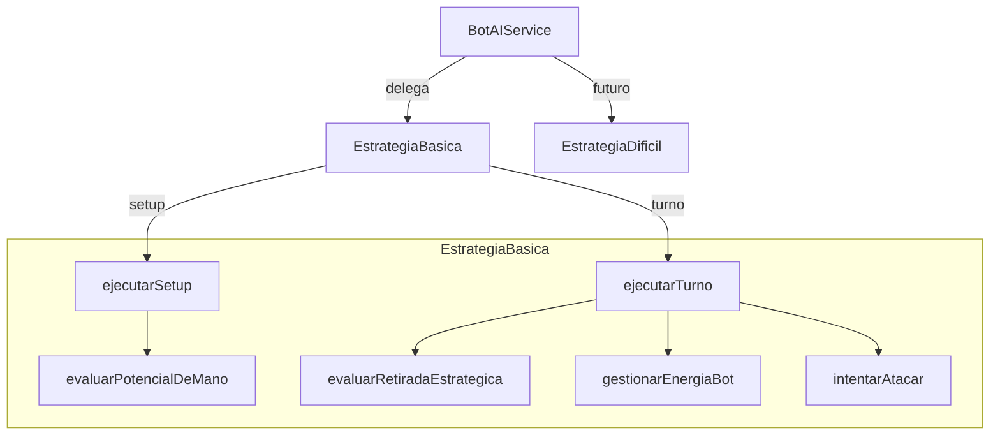
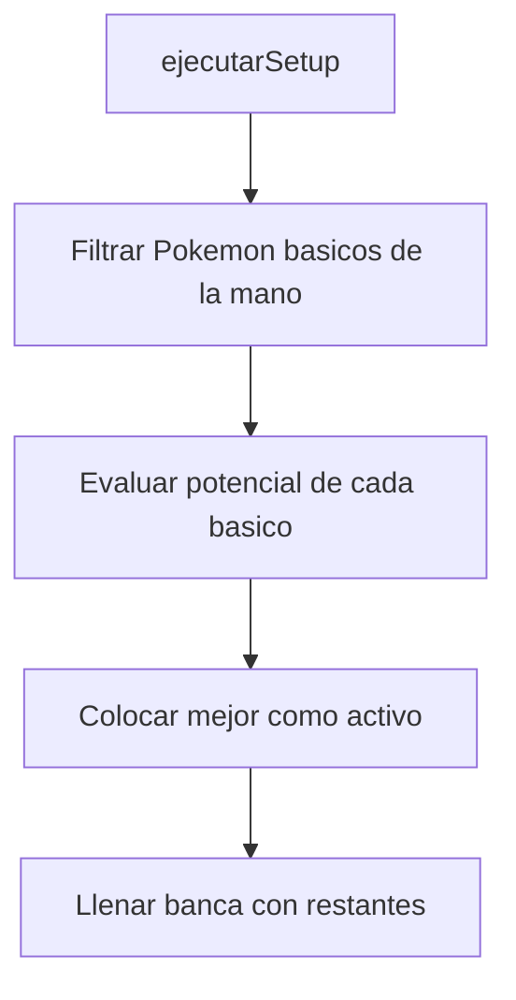
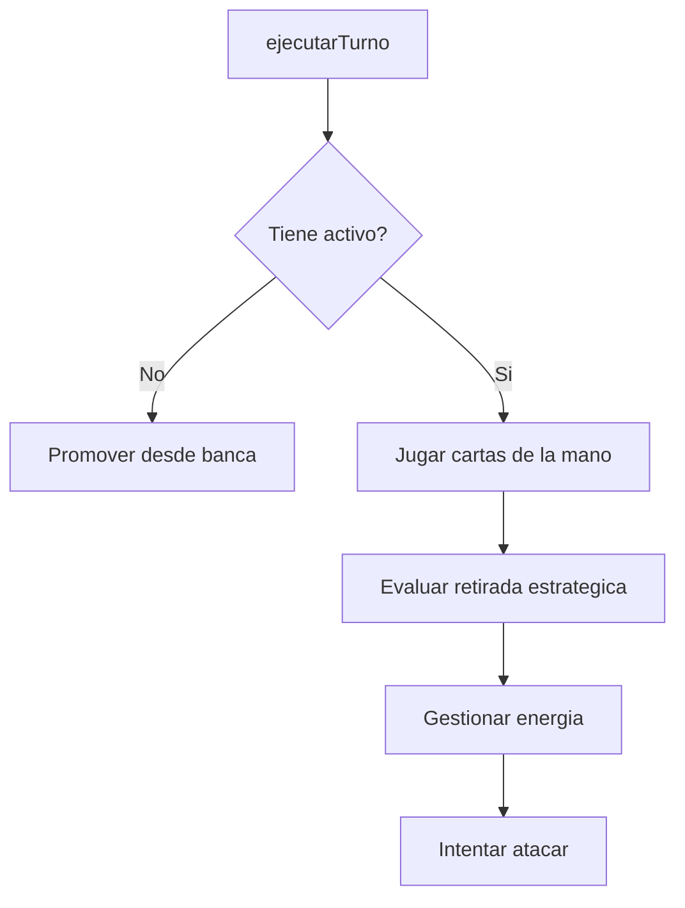
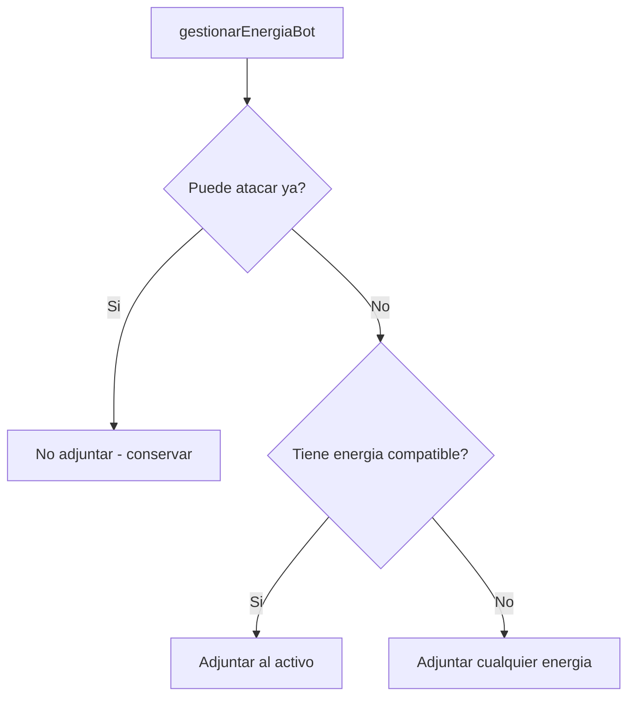
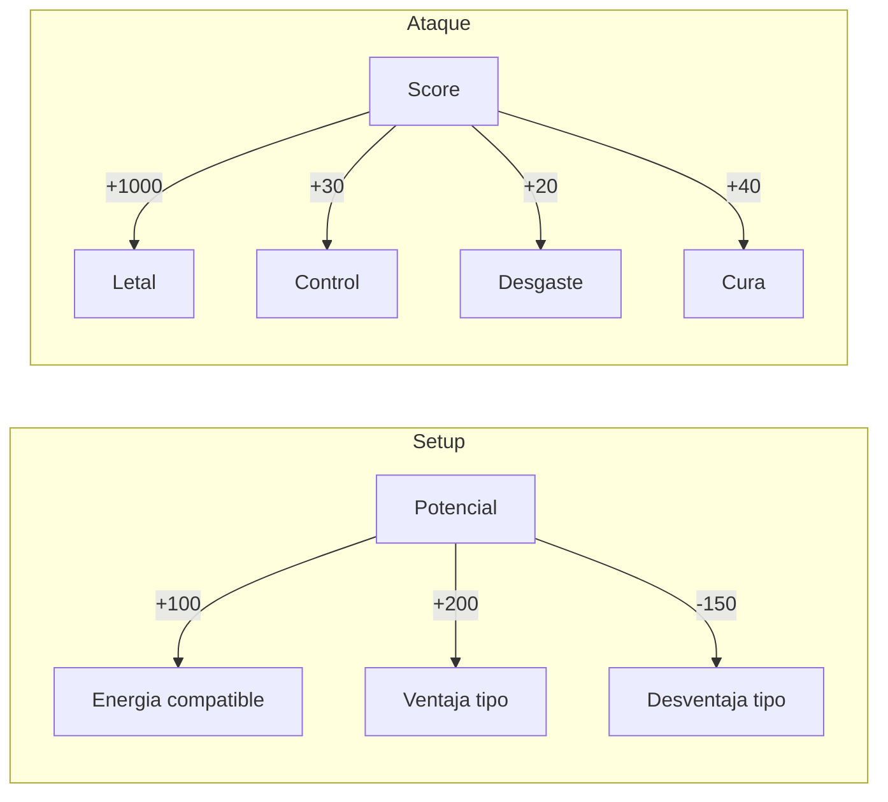

# IA de Batalla - Sistema de Decision del Bot

> Algoritmos de evaluacion estrategica para el oponente controlado por IA

---

## Arquitectura



---

## Interfaz Base

**Archivo**: `service/battle/strategy/EstrategiaBot.java`

```java
public interface EstrategiaBot {
    void ejecutarTurno(Partida partida);
    void ejecutarSetup(Partida partida);
}
```

Patron **Strategy**: permite intercambiar la logica de IA sin modificar el flujo de batalla.

---

## EstrategiaBasica

**Archivo**: `service/battle/strategy/EstrategiaBasica.java` (~450 lineas)

### Setup Inicial



El bot elige su Pokemon activo inicial evaluando el **potencial** de cada basico en mano.

### Evaluacion de Potencial

`evaluarPotencialDeMano(pokemon, energiasEnMano, activoRival)`

| Factor | Puntos | Condicion |
|--------|--------|-----------|
| Energia compatible | +100 | Por cada energia en mano que coincide con el tipo del Pokemon |
| Energia colorless | +20 | Por cada energia que puede usarse como colorless |
| Ventaja de tipo | +200 | Si el rival es debil al tipo del Pokemon |
| Desventaja de tipo | -150 | Si el Pokemon es debil al tipo del rival |

```java
// Ejemplo: Charizard (Fire) vs Venusaur (Grass)
// +200 (rival debil a Fire) + 100*N (energias Fire en mano)
// = Alta prioridad como activo
```

---

### Flujo del Turno



### Retirada Estrategica

`evaluarRetiradaEstrategica()` decide si conviene cambiar el Pokemon activo. Evalua tres condiciones:

| Condicion | Variable | Logica |
|-----------|----------|--------|
| **Peligro de muerte** | `peligroDeMuerte` | HP actual `<=` danio maximo del rival |
| **Estancado** | `estancado` | No puede pagar el costo de ningun ataque |
| **Muriendo por estados** | `muriendoPorEstados` | Tiene Poison o Burn activos |

Si alguna condicion es `true` Y hay un mejor candidato en banca, ejecuta la retirada.

---

### Gestion de Energia

`gestionarEnergiaBot()`



Solo adjunta una energia por turno (regla del TCG). Prioriza energia que coincida con el tipo del Pokemon activo.

---

### Seleccion de Ataque

`intentarAtacar()` puntua cada ataque disponible:

| Factor | Puntos | Condicion |
|--------|--------|-----------|
| Letal | +1000 | Danio >= HP actual del rival |
| Paraliza/Duerme | +30 | Efecto de control |
| Envenena/Confunde | +20 | Efecto de desgaste |
| Cura | +40 | Solo si el Pokemon esta danado |
| Roba cartas | +25 | Ventaja de recursos |

El bot elige el ataque con mayor puntaje que pueda pagar.

### Calculo de Danio

`calcularDanioFinal(danioBase, tipoAtacante, tipoDefensor)`

```
danioFinal = danioBase
if (defensor tiene debilidad al tipo atacante):
    danioFinal *= 2
if (defensor tiene resistencia al tipo atacante):
    danioFinal -= 20
```

### Pago de Costos

`puedePagarCosto(energiasUnidas, costoAtaque)`

1. Asigna energias del tipo especifico requerido primero
2. Llena requisitos Colorless con energias sobrantes de cualquier tipo
3. Retorna `true` solo si todas las posiciones del costo estan cubiertas

---

## EstrategiaDificil (Placeholder)

**Archivo**: `service/battle/strategy/EstrategiaDificil.java`

```java
public class EstrategiaDificil implements EstrategiaBot {
    @Override
    public void ejecutarTurno(Partida partida) {
        throw new UnsupportedOperationException("Not yet implemented");
    }
}
```

Reservada para una IA mas avanzada. Actualmente lanza excepcion si se intenta usar.

---

## Resumen de Scoring


