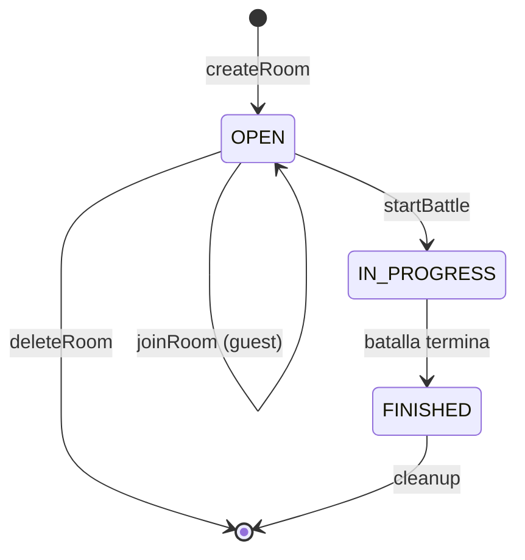
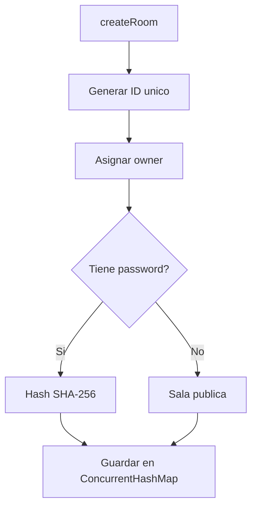
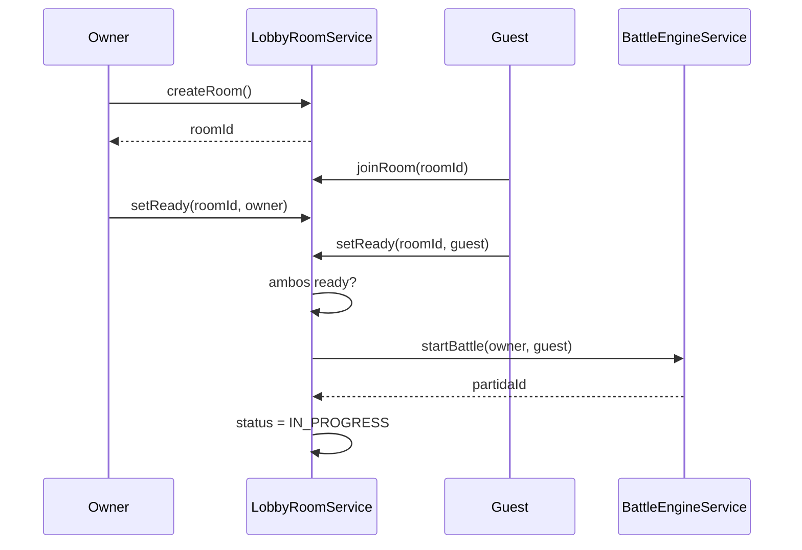
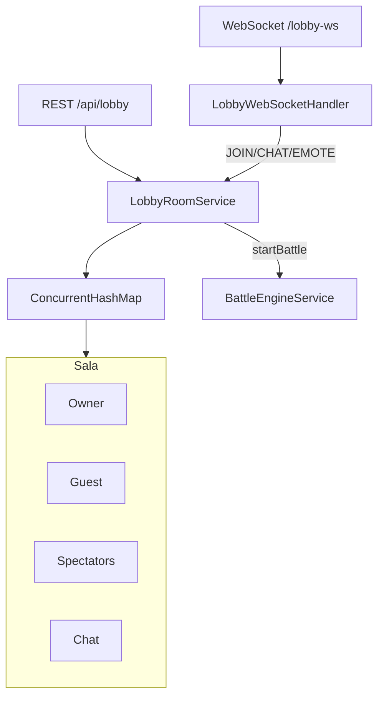

# Matchmaking - Sistema de Salas de Batalla

> Gestion de salas, emparejamiento de jugadores y espectadores

---

## Ubicacion

`backend/src/main/java/com/pokemon/tcg/service/LobbyRoomService.java`

---

## Ciclo de Vida de una Sala



### Estados (LobbyRoomStatus)

| Estado | Descripcion |
|--------|-------------|
| `OPEN` | Esperando jugadores, se puede unir |
| `IN_PROGRESS` | Batalla en curso |
| `FINISHED` | Batalla terminada |

---

## Creacion de Sala



### Campos de LobbyRoom

| Campo | Tipo | Descripcion |
|-------|------|-------------|
| `id` | `String` | UUID generado |
| `owner` | `String` | Username del creador |
| `guest` | `String` | Username del invitado |
| `ownerReady` | `boolean` | Owner listo para jugar |
| `guestReady` | `boolean` | Guest listo para jugar |
| `password` | `String` | Hash SHA-256 (nullable) |
| `spectators` | `Set<String>` | Usernames de espectadores |
| `chat` | `List<ChatMessage>` | Historial de chat |
| `reactions` | `Map<String, String>` | Reacciones por usuario |
| `status` | `LobbyRoomStatus` | Estado actual |

---

## Flujo de Matchmaking



### Ready Check

Ambos jugadores deben marcar `ready = true` antes de iniciar la batalla. El sistema verifica:

```
ownerReady && guestReady → puede iniciar batalla
```

---

## Modalidades de Juego

### PvP (Jugador vs Jugador)

1. Owner crea sala
2. Guest se une (con password si es privada)
3. Ambos seleccionan mazo y marcan ready
4. Se inicia batalla via `BattleEngineService`

### PvE (Jugador vs Bot)

1. Jugador crea sala
2. Sistema asigna bot como guest automaticamente
3. Bot siempre esta ready
4. Batalla usa `EstrategiaBasica` para las decisiones del bot

---

## Espectadores

Los espectadores pueden unirse a salas en cualquier estado:

```java
public void addSpectator(String roomId, String username) {
    room.getSpectators().add(username);
}
```

- No participan en la batalla
- Pueden ver el estado del tablero
- Acceso controlado por `BattleSpectatorGuardInterceptor`

---

## Chat y Reacciones

| Feature | Almacenamiento | Descripcion |
|---------|---------------|-------------|
| Chat | `List<ChatMessage>` | Mensajes en la sala pre-batalla |
| Reacciones | `Map<String, String>` | Una reaccion activa por usuario |

---

## Seguridad

### Password de Sala

```java
// Al crear sala con password
String hash = sha256(rawPassword);
room.setPassword(hash);

// Al unirse
if (!sha256(inputPassword).equals(room.getPassword())) {
    throw new RuntimeException("Password incorrecta");
}
```

Usa **SHA-256** para hashear passwords de salas. Las passwords nunca se almacenan en texto plano.

### Almacenamiento In-Memory

```java
private final ConcurrentHashMap<String, LobbyRoom> rooms = new ConcurrentHashMap<>();
```

Todas las salas se mantienen en memoria. No se persisten en base de datos — se pierden si el servidor reinicia.

---

## Diagrama de Arquitectura


