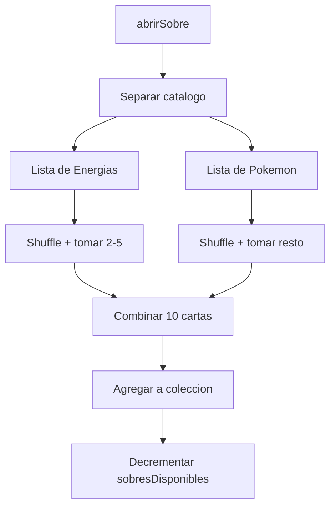
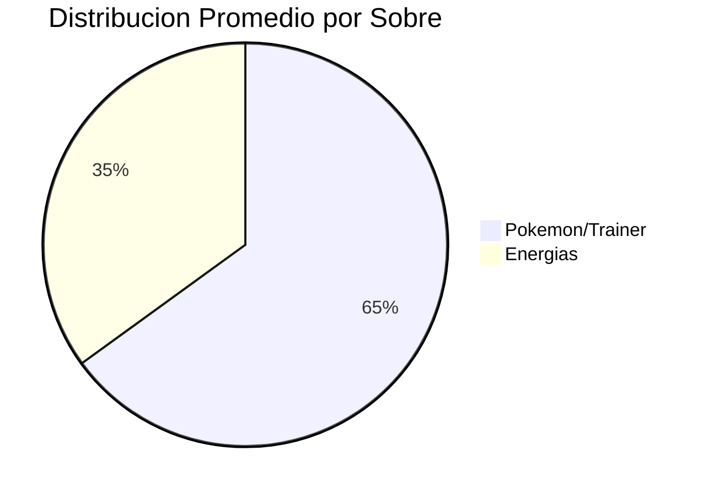

# Selector de Cartas - Algoritmo de Apertura de Sobres

> Logica de seleccion aleatoria de cartas al abrir un sobre

---

## Ubicacion

`backend/src/main/java/com/pokemon/tcg/service/SobreService.java`

---

## Algoritmo de Apertura

Cada sobre contiene **10 cartas** con una mezcla de energias y Pokemon.



### Paso a Paso

1. **Clasificar catalogo**: Separa todas las cartas en dos listas usando el campo `supertype`
   - `esEnergia(card)` → tipo "Energy"
   - `esPokemon(card)` → tipo "Pokemon" o "Trainer"

2. **Determinar proporcion**: Genera un numero aleatorio entre 2 y 5 para la cantidad de energias

3. **Seleccionar energias**: Shuffle la lista de energias, toma `subList(0, cantidadEnergias)`

4. **Seleccionar Pokemon**: Shuffle la lista de Pokemon, toma `subList(0, 10 - cantidadEnergias)`

5. **Combinar**: Une ambas sublistas en una lista de 10 cartas

6. **Persistir**: Agrega las cartas a `jugador.coleccion` y decrementa `sobresDisponibles`

---

## Distribucion de Cartas

| Tipo | Minimo | Maximo |
|------|--------|--------|
| Energias | 2 | 5 |
| Pokemon/Trainer | 5 | 8 |
| **Total** | **10** | **10** |

```java
int cantidadEnergias = random.nextInt(4) + 2; // 2 a 5
int cantidadPokemon = 10 - cantidadEnergias;  // 5 a 8
```

---

## Deteccion de Tipo

La clasificacion usa normalizacion de strings para manejar variaciones:

```java
private boolean esEnergia(Card card) {
    return card.getSupertype() != null &&
           normalizar(card.getSupertype()).contains("energy");
}

private boolean esPokemon(Card card) {
    if (card.getSupertype() == null) return false;
    String norm = normalizar(card.getSupertype());
    return norm.contains("pokemon") || norm.contains("trainer");
}
```

La funcion `normalizar()` convierte a minusculas y remueve acentos/diacriticos usando `java.text.Normalizer`.

---

## Diagrama de Distribucion



---

## Consideraciones

- **Sin rareza garantizada**: El algoritmo actual no garantiza cartas raras por sobre. La seleccion es puramente aleatoria dentro de cada categoria.
- **Duplicados posibles**: El shuffle del catalogo completo permite obtener cartas ya poseidas.
- **Backup automatico**: Tras agregar cartas a la coleccion, el sistema dispara backup via `MazoBackupService`.
- **Sobres disponibles**: Se valida que `sobresDisponibles > 0` antes de permitir la apertura.
