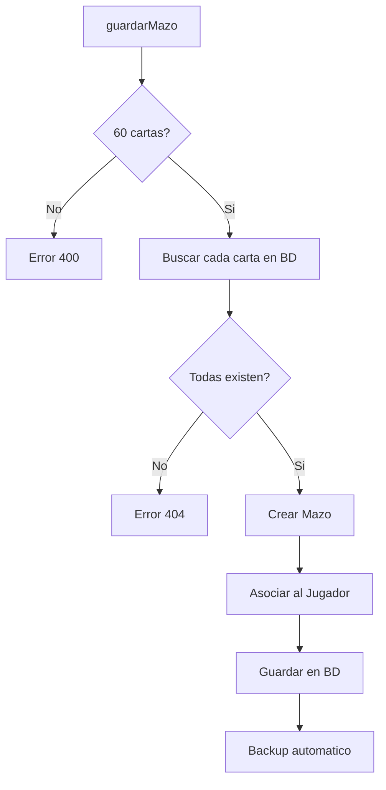
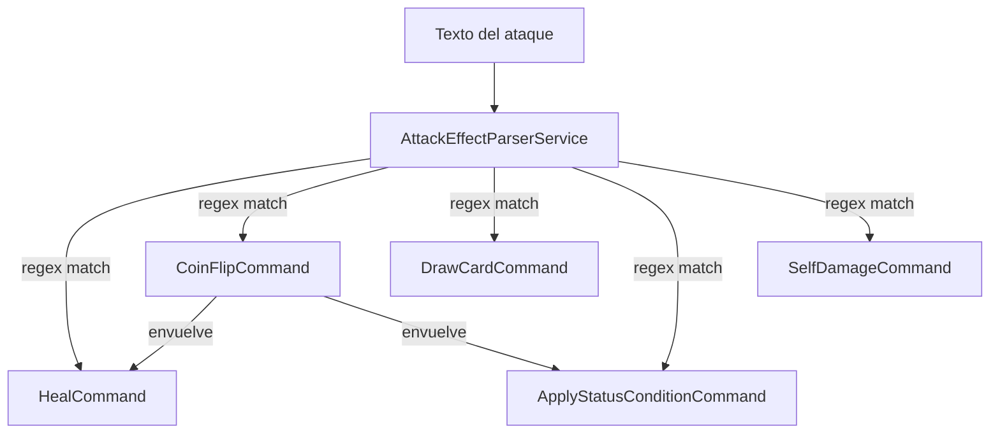
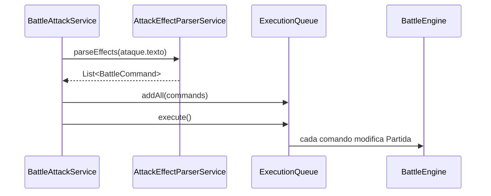

# Validador de Mazos y Parser de Efectos

> Reglas de validacion de mazos y sistema de interpretacion de efectos de ataque

---

## Validacion de Mazos

**Archivo**: `backend/src/main/java/com/pokemon/tcg/service/MazoService.java`

### Reglas de Validacion

| Regla | Validacion | Error |
|-------|-----------|-------|
| Cantidad exacta | `cartas.size() == 60` | "El mazo debe tener exactamente 60 cartas" |
| Cartas existentes | Todos los IDs existen en `CardRepository` | `"Carta no encontrada: {id}"` |



### Operaciones CRUD

| Operacion | Metodo | Validaciones |
|-----------|--------|-------------|
| Crear | `guardarMazo()` | 60 cartas, IDs validos |
| Actualizar | `actualizarMazo()` | Mazo existe, 60 cartas, IDs validos |
| Eliminar | `eliminarMazo()` | Mazo existe |
| Debug | `debugInyectarCarta()` | Reemplaza carta especifica en todo el mazo |

### Backup Automatico

Cada operacion de escritura dispara `mazoBackupService.backupAll()` para persistir el estado actual de todos los mazos.

---

## Parser de Efectos de Ataque

**Archivo**: `backend/src/main/java/com/pokemon/tcg/service/battle/command/AttackEffectParserService.java`

Convierte el texto descriptivo de los ataques en comandos ejecutables usando **expresiones regulares**.

### Patron Command



### Patrones Regex

| Patron | Ejemplo de Texto | Comando Generado |
|--------|-----------------|------------------|
| `HEAL_PATTERN` | "Heal 30 damage from this Pokemon" | `HealCommand(30)` |
| `COIN_FLIP_DAMAGE_PATTERN` | "Flip a coin. If heads, 30 more damage" | `CoinFlipCommand(DamageCommand(30))` |
| `DRAW_CARD_PATTERN` | "Draw 2 cards" | `DrawCardCommand(2)` |
| `APPLY_STATUS_PATTERN` | "Defending Pokemon is now Poisoned" | `ApplyStatusConditionCommand("Poisoned")` |
| `SELF_DAMAGE_PATTERN` | "Does 10 damage to itself" | `SelfDamageCommand(10)` |

### Efectos con Coin Flip

Algunos efectos de estado se envuelven en `CoinFlipCommand` cuando el texto incluye "flip a coin":

```
"Flip a coin. If heads, the Defending Pokemon is now Paralyzed"
→ CoinFlipCommand(ApplyStatusConditionCommand("Paralyzed"))
```

### Efectos Detectados (sin comando dedicado)

Estos efectos se detectan por `String.contains()` y se manejan dentro de la logica de batalla:

| Deteccion | Descripcion |
|-----------|-------------|
| Discard energy | Descartar energias adjuntas |
| Search deck | Buscar carta en el mazo |
| Move energy | Mover energia entre Pokemon |
| Conditional damage | Danio multiplicado por condicion |

---

## Flujo Completo de un Ataque


