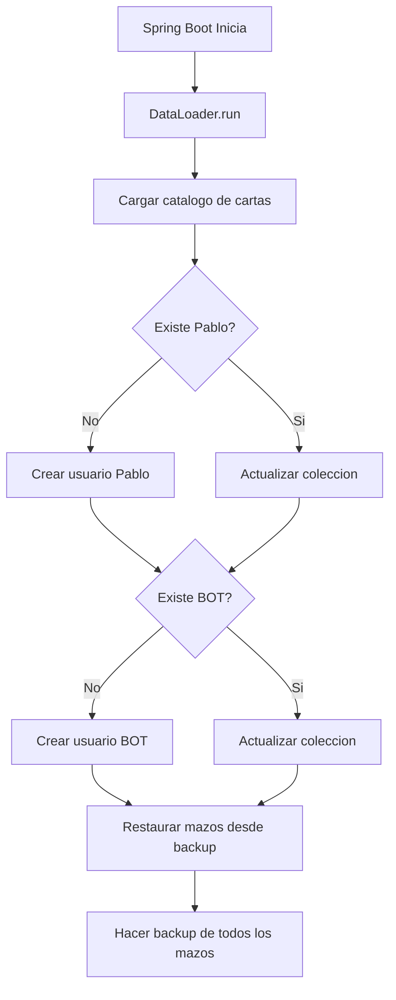

# DataLoader - Inicializacion de Datos

> Carga datos iniciales al arrancar la aplicacion (usuarios test, colecciones, mazos)

---

## Ubicacion

`backend/src/main/java/com/pokemon/tcg/config/DataLoader.java`

---

## Clase Principal

```java
@Component
public class DataLoader implements CommandLineRunner {

    private final CardCatalogService cardCatalogService;
    private final JugadorRepository jugadorRepo;
    private final MazoRepository mazoRepo;
    private final MazoBackupService mazoBackupService;

    @Override
    public void run(String... args) throws Exception { ... }
}
```

Implementa `CommandLineRunner`, por lo que `run()` se ejecuta automaticamente al iniciar Spring Boot.

---

## Flujo de Ejecucion



---

## Usuarios Creados

### Pablo (Usuario de prueba)

```java
Jugador pablo = new Jugador("Pablo");
pablo.setPasswordHash("2ab74e1d..."); // SHA-256 precomputado
pablo.setSobresDisponibles(10);
// Coleccion: 4 copias de CADA carta del catalogo
```

### BOT (Rival IA)

```java
Jugador bot = new Jugador("BOT");
bot.setCharacterId("ash");
bot.setSkinColor("#ffe0bd");
bot.setHairColor("#5c4033");
bot.setEyeColor("#2563eb");
bot.setHeight(0.82);
// Coleccion: 4 copias de CADA carta del catalogo
```

---

## Mazo por Defecto

```java
private List<Card> crearMazoPorDefecto(List<Card> todasLasCartas) {
    // 40 Pokemon basicos aleatorios (sin EX ni MEGA)
    // 20 energias aleatorias
    // Total: 60 cartas
}
```

| Tipo | Cantidad | Filtro |
|------|----------|--------|
| Pokemon | 40 | Basicos, sin EX ni MEGA |
| Energia | 20 | Cualquier tipo |
| **Total** | **60** | - |

---

## Actualizacion de Coleccion

Si un usuario ya existe, `actualizarColeccionUsuario()` verifica que tenga 4 copias de cada carta. Si faltan, las agrega. Esto asegura que nuevas cartas del catalogo se distribuyan automaticamente.

---

## Backup de Mazos

Al final del DataLoader:
1. `mazoBackupService.restoreMissingDecks()` - Restaura mazos perdidos
2. `mazoBackupService.backupAll()` - Hace backup de todos los mazos actuales
