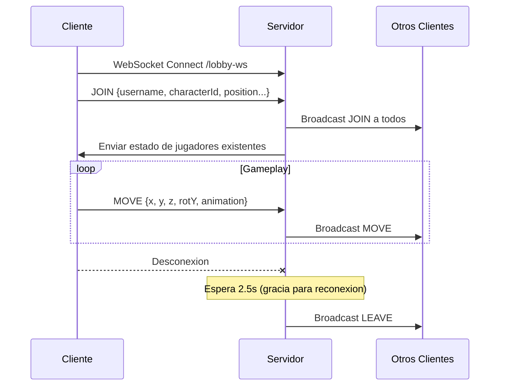

# WebSocket, Security & Interceptors

> Configuracion de WebSocket para el lobby 3D y proteccion de endpoints de batalla

---

## WebSocketConfig

**Archivo**: `config/WebSocketConfig.java`

```java
@Configuration
@EnableWebSocket
public class WebSocketConfig implements WebSocketConfigurer {

    @Autowired
    private LobbyWebSocketHandler lobbyWebSocketHandler;

    @Override
    public void registerWebSocketHandlers(WebSocketHandlerRegistry registry) {
        registry.addHandler(lobbyWebSocketHandler, "/lobby-ws")
                .setAllowedOrigins("*");
    }
}
```

| Parametro | Valor | Descripcion |
|-----------|-------|-------------|
| Endpoint | `/lobby-ws` | URL de conexion WebSocket |
| CORS | `"*"` | Acepta cualquier origen |
| Handler | `LobbyWebSocketHandler` | Procesa mensajes del lobby 3D |

---

## LobbyWebSocketHandler

**Archivo**: `config/LobbyWebSocketHandler.java`

Handler completo para la comunicacion en tiempo real del lobby multijugador 3D.

```java
@Component
public class LobbyWebSocketHandler extends TextWebSocketHandler {
    private final Map<String, WebSocketSession> sessions = new ConcurrentHashMap<>();
    private final Map<String, LobbyMessage> playersState = new ConcurrentHashMap<>();
}
```

### Tipos de Mensaje

| Tipo | Direccion | Descripcion |
|------|-----------|-------------|
| `JOIN` | Cliente -> Servidor | Registra jugador en el lobby |
| `MOVE` | Cliente -> Servidor | Actualiza posicion 3D (x, y, z, rotY, animation) |
| `CHAT` | Cliente -> Servidor | Mensaje de chat del lobby |
| `EMOTE` | Cliente -> Servidor | Emote/animacion |
| `CHALLENGE_DUEL` | P2P via servidor | Desafio a duelo |
| `CHALLENGE_DUEL_RESPONSE` | P2P via servidor | Respuesta al desafio |
| `INVITE_TRADE` | P2P via servidor | Invitacion a intercambio |
| `BATTLE_START` | P2P via servidor | Notificacion de inicio de batalla |
| `LEAVE` | Servidor -> Clientes | Jugador desconectado |

### Flujo de Conexion



### Desconexion con Gracia

```java
ScheduledFuture<?> pending = disconnectScheduler.schedule(() -> {
    // Se ejecuta 2500ms despues de la desconexion
    // Si el jugador no reconecto, se limpia su estado
}, 2500, TimeUnit.MILLISECONDS);
```

El delay de 2.5 segundos evita falsos positivos por reconexiones rapidas (ej: cambio de pagina).

---

## WebMvcConfig

**Archivo**: `config/WebMvcConfig.java`

```java
@Configuration
public class WebMvcConfig implements WebMvcConfigurer {
    @Override
    public void addInterceptors(InterceptorRegistry registry) {
        registry.addInterceptor(battleSpectatorGuardInterceptor)
                .addPathPatterns("/api/battle/**");
    }
}
```

### BattleSpectatorGuardInterceptor

Intercepta todas las requests a `/api/battle/**` y bloquea acciones de escritura de espectadores. Solo permite operaciones de lectura (GET) a usuarios marcados como spectators.

---

## OpenApiConfig

**Archivo**: `config/OpenApiConfig.java`

Configuracion de Swagger/OpenAPI para documentacion automatica de la API REST.
