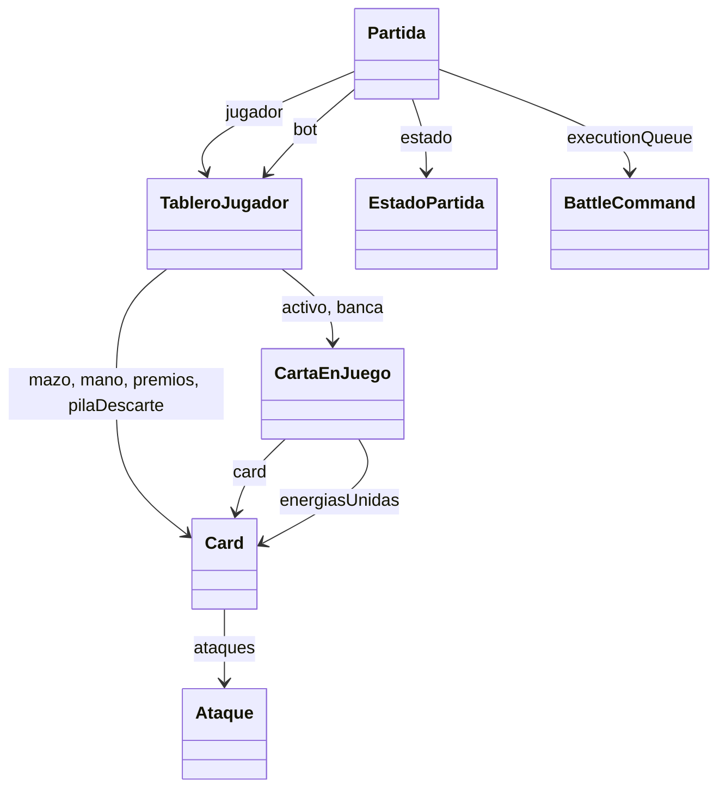

# Partida & Battle Models - Modelos de Batalla

> Clases POJO que representan el estado completo de una partida en memoria

---

## Ubicacion

`backend/src/main/java/com/pokemon/tcg/model/battle/`

---

## Partida

**Archivo**: `Partida.java`

Representa una partida completa que viaja entre backend y frontend via JSON.

```java
public class Partida {
    private String id;                   // UUID unico
    private TableroJugador jugador;      // Tablero del humano
    private TableroJugador bot;          // Tablero del bot/rival
    private Turno turnoActual;           // JUGADOR o BOT
    private Fase faseActual;             // Fase actual del juego
    private int numeroTurno = 1;
    private String ganador;
    private String razonFinPartida;

    // Estado de setup
    private int mulligansJugador = 0;
    private int mulligansBot = 0;
    private boolean setupJugadorListo = false;
    private boolean setupBotListo = false;

    // Coin flip
    private boolean coinFlipped = false;
    private String coinFlipWinner;
    private String coinFlipResult;       // "CARA" o "CRUZ"

    // Heartbeat (deteccion desconexion)
    private long jugadorLastSeenAt;
    private long botLastSeenAt;

    // Estado transient (no viaja al frontend)
    private transient EstadoPartida estado;
    private Deque<BattleCommand> executionQueue;
    private List<Boolean> ultimasMonedasLanzadas;
    private List<String> turnLogs;
}
```

### Enums Internos

#### Turno

```java
public enum Turno { JUGADOR, BOT }
```

#### Fase

```java
public enum Fase {
    INICIO,
    LANZAMIENTO_MONEDA,
    SETUP_INITIAL_DRAW,
    SETUP_MULLIGAN_EVALUATION,
    SETUP_MULLIGAN_REVEAL,
    SETUP_PLACE_ACTIVE,
    SETUP_PLACE_BENCH,
    SETUP_PRIZE_PLACEMENT,
    SETUP_MULLIGAN_EXTRA_DRAW,
    SETUP_PLACE_BENCH_EXTRA,
    SETUP_REVEAL,
    TURNO_NORMAL,
    ESPERANDO_INTERACCION,
    FIN_PARTIDA
}
```

### Maquina de Estados

La Partida usa el patron **State** para gestionar las fases:

```java
@JsonIgnore
public EstadoPartida getEstado() {
    if (estado == null) {
        estado = switch (faseActual) {
            case INICIO -> new EstadoInicio();
            case TURNO_NORMAL -> new EstadoTurnoNormal();
            case FIN_PARTIDA -> new EstadoFinPartida();
            // ... cada fase tiene su estado
        };
    }
    return estado;
}

public void transicionarA(EstadoPartida nuevoEstado) {
    this.estado = nuevoEstado;
    this.faseActual = nuevoEstado.getFase();
}
```

---

## TableroJugador

**Archivo**: `TableroJugador.java`

Agrupa todas las zonas visibles de un jugador dentro de una partida.

```java
public class TableroJugador {
    private List<Card> mazo;          // Mazo oculto
    private List<Card> mano;          // Mano privada
    private List<Card> premios;       // 6 premios ocultos
    private CartaEnJuego activo;      // Pokemon activo en batalla
    private List<CartaEnJuego> banca; // Hasta 5 Pokemon en espera
    private List<Card> pilaDescarte;  // Descarte publico
}
```

| Zona | Tipo | Visibilidad | Max |
|------|------|-------------|-----|
| `mazo` | `List<Card>` | Oculto | 60 |
| `mano` | `List<Card>` | Solo dueno | 7 inicial |
| `premios` | `List<Card>` | Oculto | 6 |
| `activo` | `CartaEnJuego` | Publico | 1 |
| `banca` | `List<CartaEnJuego>` | Publico | 5 |
| `pilaDescarte` | `List<Card>` | Publico | - |

---

## CartaEnJuego

**Archivo**: `CartaEnJuego.java`

Wrapper que agrega estado de batalla a una `Card` en el tablero.

```java
public class CartaEnJuego {
    private Card card;                          // Carta base original
    private int hpActual;                       // HP restante
    private List<Card> energiasUnidas;          // Energias adjuntadas
    private Set<String> condicionesEspeciales;  // Poisoned, Burned, Asleep, Paralyzed, Confused, CantRetreat
    private boolean puedeAtacar = true;
    private int reduccionDanioRecibido = 0;
    private int aumentoDanioCausado = 0;
    private boolean invulnerable = false;       // Escudo anti-ataque
    private boolean bocaAbajo = false;          // Durante setup
}
```

**Metodos clave**:
- `agregarCondicion(String)` - Agrega un estado especial
- `limpiarCondiciones()` - Limpia todos los estados

---

## Ataque

**Archivo**: `Ataque.java` - Entidad JPA persistida en `card_ataques`

```java
@Entity
@Table(name = "card_ataques")
public class Ataque {
    @Id @GeneratedValue
    private Long id;
    private String nombre;
    @JsonProperty("dano")
    private int danio;
    @ElementCollection
    @JsonProperty("costo")
    private List<String> tiposEnergia;  // Ej: ["Fire", "Fire", "Colorless"]
    @Column(length = 2000)
    private String texto;               // Texto de efecto (parseado por AttackEffectParserService)
}
```

---

## ResultadoAtaque

**Archivo**: `ResultadoAtaque.java` - Record inmutable

```java
public record ResultadoAtaque(int danioFinal, int carasSacadas) {}
```

---

## EstadoPartida (Interface)

**Archivo**: `state/EstadoPartida.java`

```java
public interface EstadoPartida {
    boolean permiteAccionesDeJuego();
    Partida.Fase getFase();
}
```

Implementaciones en `model/battle/state/`:

| Clase | Fase | Permite Acciones |
|-------|------|-----------------|
| `EstadoInicio` | INICIO | No |
| `EstadoLanzamientoMoneda` | LANZAMIENTO_MONEDA | No |
| `EstadoSetupInitialDraw` | SETUP_INITIAL_DRAW | No |
| `EstadoSetupMulliganReveal` | SETUP_MULLIGAN_REVEAL | No |
| `EstadoSetupPlaceActive` | SETUP_PLACE_ACTIVE | No |
| `EstadoSetupPlaceBench` | SETUP_PLACE_BENCH | No |
| `EstadoSetupPrizePlacement` | SETUP_PRIZE_PLACEMENT | No |
| `EstadoSetupMulliganExtraDraw` | SETUP_MULLIGAN_EXTRA_DRAW | No |
| `EstadoSetupPlaceBenchExtra` | SETUP_PLACE_BENCH_EXTRA | No |
| `EstadoSetupReveal` | SETUP_REVEAL | No |
| `EstadoTurnoNormal` | TURNO_NORMAL | Si |
| `EstadoEsperandoInteraccion` | ESPERANDO_INTERACCION | No |
| `EstadoFinPartida` | FIN_PARTIDA | No |

---

## Diagrama de Relaciones


