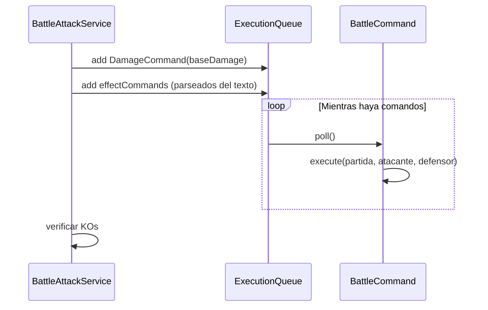

# Enums & Battle Commands

> Enumeraciones del sistema y el patron Command para efectos de ataque

---

## Enums

### Partida.Turno

```java
public enum Turno { JUGADOR, BOT }
```

Indica de quien es el turno actual. En partidas online, BOT representa al segundo jugador humano.

### Partida.Fase

```java
public enum Fase {
    INICIO,
    LANZAMIENTO_MONEDA,
    SETUP_INITIAL_DRAW,
    SETUP_MULLIGAN_EVALUATION,
    SETUP_MULLIGAN_REVEAL,
    SETUP_PLACE_ACTIVE,
    SETUP_PLACE_BENCH,
    SETUP_PRIZE_PLACEMENT,
    SETUP_MULLIGAN_EXTRA_DRAW,
    SETUP_PLACE_BENCH_EXTRA,
    SETUP_REVEAL,
    TURNO_NORMAL,
    ESPERANDO_INTERACCION,
    FIN_PARTIDA
}
```

Fases de una partida, desde inicio hasta fin. Cada fase tiene un `EstadoPartida` asociado.

### LobbyRoomStatus

**Archivo**: `model/lobby/LobbyRoomStatus.java`

```java
public enum LobbyRoomStatus {
    OPEN,          // Sala abierta, aceptando jugadores
    IN_PROGRESS,   // Partida en curso
    FINISHED       // Partida terminada
}
```

### Target

**Archivo**: `model/battle/command/Target.java`

```java
public enum Target {
    SELF,      // Efecto aplicado al atacante
    OPPONENT   // Efecto aplicado al defensor
}
```

---

## Battle Commands (Patron Command)

Los efectos de ataque se modelan como comandos que se encolan y ejecutan secuencialmente.

### Interface BattleCommand

**Archivo**: `model/battle/command/BattleCommand.java`

```java
public interface BattleCommand {
    void execute(Partida partida, TableroJugador atacante, TableroJugador defensor);
}
```

### Comandos Disponibles

| Comando | Descripcion |
|---------|-------------|
| `DamageCommand` | Aplica dano directo al defensor activo |
| `SelfDamageCommand` | Aplica dano al atacante (retroceso) |
| `HealCommand` | Cura HP al atacante |
| `ApplyStatusConditionCommand` | Aplica estado (Poisoned, Burned, etc.) |
| `CoinFlipCommand` | Lanza moneda y condiciona efecto |
| `ConditionalDamageMultiplierCommand` | Multiplica dano por monedas |
| `DiscardEnergyCommand` | Descarta energias del atacante |
| `DrawCardCommand` | Roba cartas del mazo |
| `MoveEnergyCommand` | Mueve energia entre Pokemon |
| `SearchDeckCommand` | Busca carta en el mazo |

### Flujo de Ejecucion



### AttackEffectParserService

**Archivo**: `service/battle/command/AttackEffectParserService.java`

Parsea el texto descriptivo de un ataque y genera la lista de `BattleCommand`s correspondientes.

Ejemplo: `"Flip a coin. If heads, the Defending Pokemon is now Paralyzed."` genera:
1. `CoinFlipCommand`
2. `ApplyStatusConditionCommand("Paralyzed", Target.OPPONENT)`
