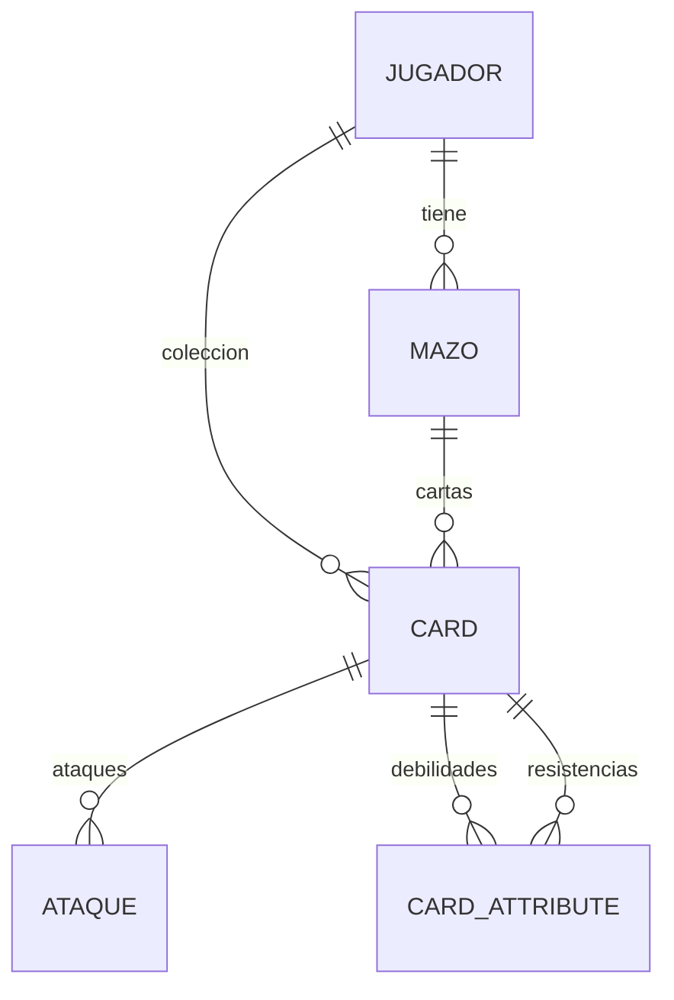

# Repositories - Acceso a Datos

> Interfaces Spring Data JPA que abstraen el acceso a la base de datos H2

---

## Ubicacion

`backend/src/main/java/com/pokemon/tcg/repository/`

---

## Arquitectura

Todos los repositorios extienden `JpaRepository` de Spring Data, que provee operaciones CRUD automaticas sin necesidad de implementacion.

```java
public interface XxxRepository extends JpaRepository<Entity, IdType> {
    // Spring genera la implementacion en runtime
}
```

---

## JugadorRepository

**Archivo**: `JugadorRepository.java`

```java
@Repository
public interface JugadorRepository extends JpaRepository<Jugador, Long> {

    @Query("SELECT j FROM Jugador j LEFT JOIN FETCH j.coleccion WHERE j.username = :username")
    Jugador findByUsername(@Param("username") String username);

    @Query("SELECT j FROM Jugador j WHERE j.username = :username")
    Jugador findAuthByUsername(@Param("username") String username);

    Jugador findByEmail(String email);

    Jugador findByPasswordResetTokenHash(String passwordResetTokenHash);
}
```

| Metodo | Tipo | Descripcion |
|--------|------|-------------|
| `findByUsername` | JPQL custom | Busca jugador con coleccion (FETCH JOIN) |
| `findAuthByUsername` | JPQL custom | Busca jugador SIN coleccion (mas rapido, para auth) |
| `findByEmail` | Derived query | Busca por email (recovery) |
| `findByPasswordResetTokenHash` | Derived query | Busca por token de reset |

**Nota**: `findByUsername` usa `LEFT JOIN FETCH j.coleccion` para cargar la coleccion completa en una sola query, evitando el problema N+1.

---

## CardRepository

**Archivo**: `CardRepository.java`

```java
@Repository
public interface CardRepository extends JpaRepository<Card, String> {

    @Query(value = "SELECT * FROM cards ORDER BY RAND() LIMIT 10", nativeQuery = true)
    List<Card> findTenRandomCards();
}
```

| Metodo | Tipo | Descripcion |
|--------|------|-------------|
| `findAll()` | JpaRepository | Todas las cartas del catalogo |
| `findById(String)` | JpaRepository | Carta por ID (ej: "base1-1") |
| `findTenRandomCards` | Native query | 10 cartas aleatorias (para sobres) |

**Nota**: El ID de Card es `String` (no `Long`) porque usa IDs del catalogo Pokemon TCG (ej: `"base1-1"`, `"bw10-3"`).

---

## MazoRepository

**Archivo**: `MazoRepository.java`

```java
@Repository
public interface MazoRepository extends JpaRepository<Mazo, Long> {

    List<Mazo> findByJugador(Jugador jugador);
}
```

| Metodo | Tipo | Descripcion |
|--------|------|-------------|
| `findAll()` | JpaRepository | Todos los mazos |
| `findById(Long)` | JpaRepository | Mazo por ID |
| `findByJugador` | Derived query | Mazos de un jugador especifico |
| `save(Mazo)` | JpaRepository | Guardar/actualizar mazo |
| `deleteById(Long)` | JpaRepository | Eliminar mazo |

---

## Operaciones Heredadas de JpaRepository

Todos los repos heredan estos metodos sin necesidad de declararlos:

```java
// CRUD basico
T save(T entity);
Optional<T> findById(ID id);
List<T> findAll();
void deleteById(ID id);
long count();
boolean existsById(ID id);

// Batch
List<T> saveAll(Iterable<T> entities);
void deleteAll(Iterable<T> entities);

// Paginacion y ordenamiento
Page<T> findAll(Pageable pageable);
List<T> findAll(Sort sort);
```

---

## Diagrama de Relaciones


