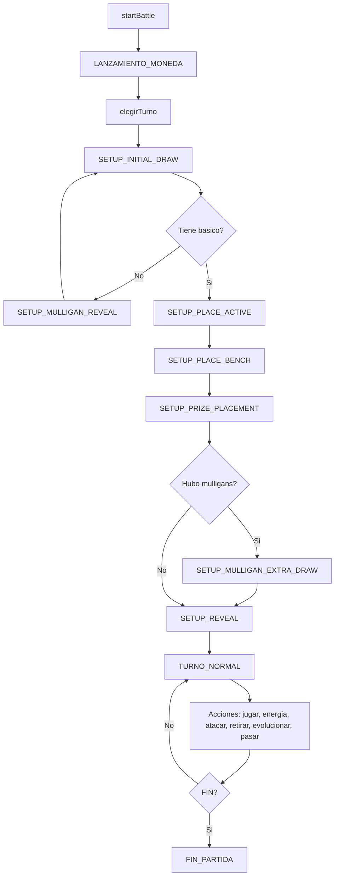

# ⚔️ BattleEngineService - Motor Principal de Batalla

> Orquesta toda la partida: setup, turnos, acciones, mulligan, ataques, desconexion y debug

---

## Ubicacion

`backend/src/main/java/com/pokemon/tcg/service/BattleEngineService.java`

---

## Clase Principal

```java
@Service
public class BattleEngineService {
    private final JugadorRepository jugadorRepo;
    private final MazoRepository mazoRepo;
    private final CardRepository cardRepo;
    private final Random random = new Random();
    private final Map<String, Partida> partidasEnCurso = new ConcurrentHashMap<>();
    private final BotAIService botAIService;
    private final BattleAttackService battleAttackService;
    private final BattleKoService battleKoService;
}
```

**Responsabilidades**:
- Crear partidas (singleplayer y online)
- Gestionar el flujo de setup (moneda, mulligan, premios, reveal)
- Ejecutar acciones de turno (jugar carta, unir energia, atacar, retirarse, evolucionar)
- Manejar turnos del bot (IA)
- Deteccion de desconexion y rendicion
- Funciones de debug (God Mode)

---

## Almacenamiento en Memoria

```java
private final Map<String, Partida> partidasEnCurso = new ConcurrentHashMap<>();
```

Las partidas viven en memoria (no en BD). Cada partida se identifica por UUID y se almacena en un `ConcurrentHashMap` thread-safe.

---

## Metodos de Inicio de Partida

### startBattle(username, mazoId) - Singleplayer

```java
@Transactional
public Partida startBattle(String username, Long mazoId)
```

| Parametro | Tipo | Descripcion |
|-----------|------|-------------|
| `username` | `String` | Nombre del jugador |
| `mazoId` | `Long` | ID del mazo seleccionado |

**Flujo**:
1. Busca jugador y mazo en BD
2. Valida que el mazo tenga 60 cartas
3. Crea snapshot del mazo (copia profunda de cada carta)
4. Baraja ambos mazos (jugador y bot usan el mismo pool)
5. Reparte 7 cartas a cada mano
6. Transiciona a `LANZAMIENTO_MONEDA`
7. Guarda en `partidasEnCurso`

**Retorna**: `Partida` con estado inicial

### startBattleOnline(player1, player1MazoId, player2, player2MazoId) - Multiplayer

```java
@Transactional
public Partida startBattleOnline(String player1, Long player1MazoId, String player2, Long player2MazoId)
```

Igual que `startBattle` pero con dos jugadores humanos. Setea `botUsername` con el nombre del segundo jugador.

---

## Flujo de Setup (Fase Pre-Batalla)

El setup sigue esta secuencia de fases:

```
LANZAMIENTO_MONEDA -> SETUP_INITIAL_DRAW -> SETUP_MULLIGAN_REVEAL (si necesario)
-> SETUP_PLACE_ACTIVE -> SETUP_PLACE_BENCH -> SETUP_PRIZE_PLACEMENT
-> SETUP_MULLIGAN_EXTRA_DRAW (si hubo mulligans) -> SETUP_PLACE_BENCH_EXTRA
-> SETUP_REVEAL -> TURNO_NORMAL
```

### lanzarMoneda(matchId, callerUsername, eleccion)

Lanza una moneda (CARA/CRUZ). El ganador elige quien va primero.

### elegirTurno(matchId, vaPrimero, callerUsername)

El ganador de la moneda decide si va primero o segundo. Transiciona a `SETUP_INITIAL_DRAW`.

### evaluarSetupInitialDraw(matchId, username)

Verifica si ambos jugadores tienen Pokemon basico en mano. Si alguno no tiene, va a `SETUP_MULLIGAN_REVEAL`.

### ejecutarMulligan(matchId, username)

Ejecuta mulligan: devuelve mano al mazo, baraja, roba 7 nuevas. Repite hasta que ambos tengan un basico.

### colocarActivoSetup / colocarBancaSetup / confirmarBancaSetup

Permiten colocar Pokemon basicos boca abajo durante el setup.

### colocarPremios(matchId, username)

Coloca 6 premios del tope del mazo. Luego evalua si hay cartas extra por mulligan.

### confirmarRevealSetup(matchId, username)

Revela las cartas boca abajo e inicia el primer turno normal.

---

## Acciones de Turno Normal

Todas las acciones de turno validan que sea el turno correcto del caller.

### jugarPokemon(matchId, cartaId, callerUsername)

Baja un Pokemon basico de la mano a la banca.

### unirEnergia(matchId, cartaId, energiaId, callerUsername)

Une una carta de energia de la mano a un Pokemon en el tablero.

### realizarAtaque(matchId, nombreAtaqueElegido, callerUsername)

Ejecuta un ataque. No se puede atacar en el turno 1. Delega el calculo de dano a `BattleAttackService` y la resolucion de KOs a `BattleKoService`. Automaticamente pasa el turno al terminar.

### realizarRetirada(matchId, nuevoActivoId, callerUsername)

Retira el activo y sube uno de la banca.

### evolucionarPokemon(matchId, cartaManoId, cartaTableroId, callerUsername)

Evoluciona un Pokemon del tablero usando una carta de la mano.

### pasarTurno(matchId, callerUsername)

Finaliza el turno actual:
1. Limpia condiciones temporales (Paralyzed, CantRetreat)
2. Apaga invulnerabilidad del oponente
3. Aplica mantenimiento entre turnos (veneno, quemadura, sueno)
4. Incrementa numero de turno
5. Roba una carta para el siguiente jugador

---

## Turno del Bot

### ejecutarTurnoBot(matchId)

1. Roba carta del mazo del bot
2. Delega a `BotAIService.ejecutarTurno()`
3. Limpia condiciones temporales
4. Aplica mantenimiento entre turnos
5. Pasa turno al jugador

### ejecutarSetupBot(matchId)

Delega el setup del bot (colocar activo, banca) a `BotAIService.ejecutarSetup()`.

---

## Heartbeat y Desconexion

```java
private static final long ONLINE_DISCONNECT_TIMEOUT_MS = 30_000L;
```

### registrarHeartbeat(matchId, username)

Actualiza el timestamp `lastSeenAt` del jugador. Se usa para detectar desconexiones.

### evaluarDesconexionOnline(partida, callerUsername)

Si un jugador no envio heartbeat por mas de 30 segundos, el rival gana por desconexion.

### rendirse(matchId, username)

El jugador se rinde voluntariamente. Transiciona a `FIN_PARTIDA`.

---

## Funciones de Debug (God Mode)

### debugRobarCarta(matchId, cardId)

Inyecta cualquier carta del catalogo en la mano del jugador.

### debugForzarEstado(matchId, objetivo, estado)

Aplica un estado especial (Poisoned, Burned, etc.) a un Pokemon.

### debugSetHp(matchId, objetivo, hp)

Fuerza el HP de un Pokemon. Si llega a 0, ejecuta resolucion de KO.

---

## Mantenimiento Entre Turnos

```java
private void aplicarMantenimientoEntreTurnos(Partida partida)
```

Procesa estados de ambos jugadores:

| Estado | Efecto |
|--------|--------|
| **Poisoned** | -10 HP por turno |
| **Burned** | -20 HP + moneda (CARA = se cura) |
| **Asleep** | Moneda (CARA = despierta) |

Si un Pokemon llega a 0 HP por estado alterado, se ejecuta `BattleKoService.resolverKO()`.

---

## Servicios Auxiliares

### BattleService

`backend/src/main/java/com/pokemon/tcg/service/BattleService.java`

Servicio legado con metodos basicos de manipulacion de tablero: `robarCartas()`, `tienePokemonBasico()`, `realizarMulligan()`, `bajarAPrimerBanca()`.

### BattleAttackService

`backend/src/main/java/com/pokemon/tcg/service/BattleAttackService.java`

Resuelve el dano de un ataque:
1. Agrega comando de dano base a la cola de ejecucion
2. Parsea efectos de texto del ataque en `BattleCommand`s
3. Ejecuta la cola iterativamente
4. Verifica KOs post-ataque

### BattleKoService

`backend/src/main/java/com/pokemon/tcg/service/BattleKoService.java`

Maneja la muerte de un Pokemon:
1. Descarta la carta del tablero
2. Entrega 1 premio al ganador
3. Verifica condiciones de victoria (sin premios / sin Pokemon)
4. Bot auto-selecciona reemplazo estrategico (por HP, energias y matchup)

### BattleTurnService

`backend/src/main/java/com/pokemon/tcg/service/BattleTurnService.java`

Maneja limpieza de turno y estados entre turnos. Procesa Poisoned, Burned y Asleep.

### BotAIService

`backend/src/main/java/com/pokemon/tcg/service/BotAIService.java`

Delega a `EstrategiaBasica` para ejecutar turnos y setup del bot.

```java
@Service
public class BotAIService {
    private final EstrategiaBot estrategia = new EstrategiaBasica();

    public void ejecutarTurno(Partida partida) { ... }
    public void ejecutarSetup(Partida partida) { ... }
}
```

### LobbyRoomService

`backend/src/main/java/com/pokemon/tcg/service/LobbyRoomService.java`

Gestiona salas de matchmaking online:
- Crear/unir/salir de salas
- Sistema de password con SHA-256
- Ready check y arranque de partida
- Chat y reacciones en tiempo real
- Soporte de espectadores
- Bot como invitado

---

## Diagrama de Flujo General


