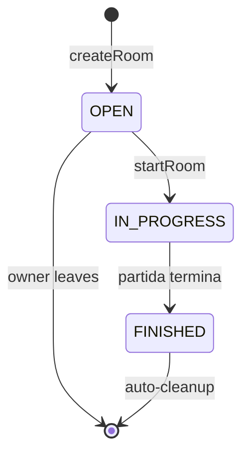

# LobbyRoomService - Gestion de Salas Online

> Servicio para crear, administrar y sincronizar salas de matchmaking multijugador

---

## Ubicacion

`backend/src/main/java/com/pokemon/tcg/service/LobbyRoomService.java`

---

## Clase Principal

```java
@Service
public class LobbyRoomService {
    private final Map<String, LobbyRoom> rooms = new ConcurrentHashMap<>();
    private final BattleEngineService battleEngineService;
    private final MazoRepository mazoRepository;
}
```

**Responsabilidades**:
- CRUD de salas de batalla
- Sistema de ready-check
- Chat y reacciones en tiempo real
- Soporte de espectadores
- Proteccion por password (SHA-256)
- Inicio de partida (singleplayer con bot o multiplayer)

---

## Almacenamiento

Las salas viven en memoria (`ConcurrentHashMap`). Se sincronizan con el estado de las partidas activas para detectar finalizaciones.

---

## Metodos Principales

### Ciclo de Vida de Sala

| Metodo | Descripcion |
|--------|-------------|
| `createRoom(username, request)` | Crea sala. Valida mazo (60 cartas). Soporta password opcional |
| `joinRoom(roomId, username, request)` | Unirse como guest. Valida password. Si `IN_PROGRESS` entra como spectator |
| `leaveRoom(roomId, username)` | Si owner: cierra sala. Si guest: sale. Limpia spectators |
| `kickGuest(roomId, ownerUsername)` | Solo el owner puede echar al guest |
| `addBot(roomId, ownerUsername)` | Agrega un bot como rival con "Mazo espejo" |

### Ready y Arranque

| Metodo | Descripcion |
|--------|-------------|
| `setReady(roomId, username, ready, mazoId)` | Marca listo/no-listo. Permite cambiar mazo |
| `startRoom(roomId, ownerUsername)` | Inicia la partida si ambos estan listos. Delega a `BattleEngineService` |

### Chat y Reacciones

| Metodo | Descripcion |
|--------|-------------|
| `addChat(roomId, username, text)` | Mensaje de chat (max 160 chars, ultimos 30 mensajes) |
| `addReaction(roomId, username, reaction)` | Reaccion animada (max 24 chars, ultimas 18, expiran en 6s) |
| `addReactionByMatchId(matchId, username, reaction)` | Reaccion por ID de partida |

### Espectadores

| Metodo | Descripcion |
|--------|-------------|
| `spectateRoom(roomId, username, password)` | Entrar como espectador (valida password) |
| `isSpectator(matchId, username)` | Verifica si un usuario es espectador de una partida |

### Consulta

| Metodo | Descripcion |
|--------|-------------|
| `listRooms(username)` | Lista todas las salas activas (filtra finalizadas) |
| `getRoom(roomId, username)` | Detalle de una sala |
| `getRoomByMatchId(matchId, username)` | Busca sala por ID de partida |

---

## Validaciones de Seguridad

- **Un usuario por sala**: `ensureUserCanEnterRoom()` impide estar en multiples salas
- **Solo owner ejecuta**: `requireOwner()` para kick, addBot, start
- **Password con hash**: `hashPassword()` usa SHA-256
- **Mazo de 60 cartas**: `requireDeck()` valida tamano

---

## Snapshot (DTO)

Las salas se exponen al frontend como `LobbyRoomSnapshot`:

```java
LobbyRoomSnapshot {
    id, name, status, locked,
    ownerUsername, ownerDeckName, ownerReady,
    guestUsername, guestDeckName, guestReady, guestBot,
    playerCount, spectatorCount, matchId,
    canJoin, canSpectate, currentUserSpectator,
    chat (ultimos 30), reactions (ultimas 18)
}
```

---

## Estado de la Sala


