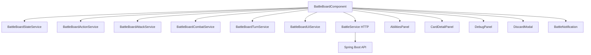

# BattleBoardComponent - Tablero de Batalla

> Componente principal que renderiza toda la interfaz de batalla Pokemon TCG

---

## Ubicacion

`frontend/src/app/features/battle/battle-board.component.ts`

---

## Componente

```typescript
@Component({
  selector: 'app-battle-board',
  standalone: true,
  imports: [
    CommonModule,
    DragDropModule,
    BattleBoardAbilitiesPanelComponent,
    BattleBoardCardDetailPanelComponent,
    BattleBoardDebugPanelComponent,
    BattleBoardDiscardModalComponent,
    TranslatePipe,
    BattleNotificationComponent,
  ],
})
export class BattleBoardComponent implements OnInit, OnDestroy
```

---

## Servicios Inyectados

| Servicio | Uso |
|----------|-----|
| `BattleService` | Comunicacion HTTP con el backend |
| `BattleBoardStateService` | Estado reactivo de la partida |
| `BattleBoardActionService` | Acciones del jugador (jugar carta, energia, etc) |
| `BattleBoardAttackService` | Logica de ataques y monedas |
| `BattleBoardCombatService` | Resolucion de combate |
| `BattleBoardTurnService` | Gestion de turnos |
| `BattleBoardUiService` | Animaciones y efectos visuales |
| `BattleNotificationService` | Notificaciones en pantalla |
| `ImagePreloaderService` | Precarga de imagenes de cartas |
| `JugadorService` | Datos del jugador |
| `LobbyRoomService` | Sala de batalla (chat, reacciones) |
| `I18nService` | Internacionalizacion |

---

## Estado Principal

```typescript
matchId: string | null = null;
partida: Partida | null = null;
jugadorNombre = '';
isSpectator = false;
battleRoom: LobbyRoomSnapshot | null = null;
```

### Estado Visual

| Propiedad | Tipo | Descripcion |
|-----------|------|-------------|
| `boardVisible` | `boolean` | Tablero visible (post-intro) |
| `showIntro` | `boolean` | Pantalla de carga |
| `showTurnOverlay` | `boolean` | Overlay "Tu turno" / "Turno rival" |
| `animandoAtaque` | `boolean` | Animacion de ataque en curso |
| `botPensando` | `boolean` | Indicador de que el bot piensa |
| `modoSeleccionRetirada` | `boolean` | Seleccionando Pokemon para retirada |
| `cargandoAccion` | `boolean` | Esperando respuesta del servidor |

### Timer de Turno

```typescript
tiempoTurnoMaximo = 60;
tiempoRestante = 60;
porcentajeTimer = 100;
turnTimerEnabled = false;
```

---

## Drag & Drop

Usa Angular CDK Drag Drop con 3 zonas:

| Drop Zone ID | Zona |
|--------------|------|
| `player-hand-dropzone` | Mano del jugador |
| `player-active-dropzone` | Pokemon activo |
| `player-bench-dropzone` | Banca (hasta 5) |

Las cartas se arrastran desde la mano hacia el activo o banca para jugarlas.

---

## Escena 3D (Three.js)

El componente integra Three.js para:
- **Modelos de personaje**: Modelos GLB con animaciones (Hilda, Lillie, Ash, Robot)
- **Handshake de moneda**: Animacion interactiva pre-batalla
- **Efectos de particulas**: Dano, curacion, estados

```typescript
const CHARACTER_OPTIONS = [
  { id: 'hilda-sygna', label: 'Hilda Sygna', path: '/models-optimized/characters/hilda_sygna_10.glb' },
  { id: 'lillie', label: 'Lillie', path: '/models-optimized/characters/lillie__anniversary_50.glb' },
  { id: 'ash', label: 'Ash', path: '/models-optimized/characters/ash_ketchup_-_pokemon.glb' },
  { id: 'robot', label: 'Robot CC0', path: '/models-optimized/player/RobotExpressive.glb' },
];
```

---

## Sub-Componentes

| Componente | Selector | Descripcion |
|------------|----------|-------------|
| `BattleBoardAbilitiesPanelComponent` | Panel de habilidades | Muestra habilidades del Pokemon seleccionado |
| `BattleBoardCardDetailPanelComponent` | Detalle de carta | Zoom/info de carta al hover |
| `BattleBoardDebugPanelComponent` | Panel debug (F3) | God Mode: inyectar cartas, forzar HP/estados |
| `BattleBoardDiscardModalComponent` | Modal descarte | Para seleccionar energias a descartar |
| `BattleNotificationComponent` | Notificaciones | Toast messages de acciones |

---

## Hover y Detalle de Cartas

```typescript
hoveredCard: Card | BattleActionCard | null = null;
hoveredInPlayCard: CartaEnJuego | null = null;
hoveredCardStatuses: CardGlossaryEntry[] = [];
hoveredCardList: HoveredBattleCard[] = [];
```

Al pasar el mouse sobre una carta, muestra informacion detallada incluyendo glosario de estados especiales.

---

## Efectos Visuales

| Efecto | Descripcion |
|--------|-------------|
| `cartasNuevas` | Animacion de brillo en cartas recien robadas |
| `healedTextPlayer/Bot` | Texto flotante de curacion |
| `curingParalysisPlayer/Bot` | Animacion de cura de paralisis |
| `curingSleepPlayer/Bot` | Animacion de despertar |
| `vibrarBot` | Animacion de vibracion al recibir dano |
| `DamageNumberState` | Numeros de dano flotantes |
| `ParticleVisualState` | Sistema de particulas |

---

## Diagrama de Arquitectura


