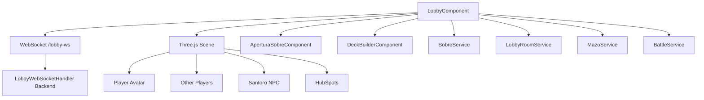

# LobbyComponent - Campus 3D Multijugador

> Lobby interactivo 3D con Three.js donde los jugadores se mueven, chatean y acceden a funcionalidades

---

## Ubicacion

`frontend/src/app/features/lobby/lobby.component.ts`

---

## Componente

```typescript
@Component({
  selector: 'app-lobby',
  standalone: true,
  imports: [CommonModule, FormsModule, AperturaSobreComponent, DeckBuilderComponent, TranslatePipe]
})
export class LobbyComponent implements OnInit, AfterViewInit, OnDestroy
```

---

## Servicios Inyectados

| Servicio | Uso |
|----------|-----|
| `SobreService` | Apertura de sobres de cartas |
| `LobbyRoomService` | Salas de matchmaking |
| `MazoService` | Gestion de mazos |
| `JugadorService` | Datos del jugador |
| `BattleService` | Inicio de batallas |
| `CardService` | Catalogo de cartas |
| `ImagePreloaderService` | Precarga de assets |
| `I18nService` | Internacionalizacion |

---

## Mundo 3D (Three.js)

El lobby es un **campus 3D** donde el jugador controla un avatar que se mueve libremente.

### Canvas

```typescript
@ViewChild('hubCanvas', { static: true }) hubCanvas!: ElementRef<HTMLCanvasElement>;
```

### Personajes

```typescript
interface CharacterOption {
  id: string;         // 'hilda-sygna', 'lillie', 'ash', 'robot'
  label: string;
  path: string;       // Ruta al modelo GLB
  scale: number;
  idleHints: string[];
  walkHints: string[];
  runHints: string[];
}
```

Cada personaje tiene animaciones de idle, caminar y correr cargadas desde modelos GLB optimizados.

---

## HubSpots (Puntos de Interes)

El campus tiene zonas interactivas que abren diferentes funcionalidades:

| Hub | ID | Funcion |
|-----|-----|---------|
| Deck Builder | `deck` | Abre el constructor de mazos |
| Battle Arena | `battle` | Abre las salas de batalla |
| Packs Shop | `packs` | Abre la tienda de sobres |
| Santoro NPC | `santoro` | NPC con dialogos y regalos |

```typescript
interface HubSpot {
  id: 'deck' | 'battle' | 'packs' | 'santoro';
  short: string;
  kicker: string;
  label: string;
  description: string;
  position: THREE.Vector3;
  color: number;
}
```

---

## WebSocket Multiplayer

Conexion WebSocket a `/lobby-ws` para sincronizar jugadores en tiempo real.

```typescript
private socket?: WebSocket;
otherPlayers = new Map<string, OtherPlayerNPC>();
```

### OtherPlayerNPC

```typescript
interface OtherPlayerNPC {
  username: string;
  characterId: string;
  skinColor: string;
  hairColor: string;
  eyeColor: string;
  root: THREE.Group;
  mixer?: THREE.AnimationMixer;
  targetPosition: THREE.Vector3;
  targetRotationY: number;
  currentAnimation: 'idle' | 'walking' | 'running';
  chatBubble?: string;
}
```

Cada jugador remoto se renderiza como un modelo 3D que interpola su posicion y animaciones.

---

## Chat y Emotes

```typescript
chatActive = false;
```

Los jugadores pueden:
- Enviar mensajes de chat (aparecen como burbujas sobre el avatar)
- Enviar emotes (animaciones predefinidas)
- Desafiar a duelos directos

---

## Santoro NPC

NPC interactivo con un sistema de dialogos con estados:

```typescript
type SantoroDialogState = 'intro' | 'thanks' | 'forced' | 'gift' | 'afterGift' | 'repeat';
```

---

## Paneles Flotantes

```typescript
type FloatingLobbyPanel = 'chat' | 'decks' | 'help';
```

Paneles que se pueden abrir sobre el lobby 3D sin salir del campus.

---

## Sub-Componentes Integrados

| Componente | Uso |
|------------|-----|
| `AperturaSobreComponent` | Animacion 3D de apertura de sobres |
| `DeckBuilderComponent` | Constructor de mazos (embebido) |

---

## Diagrama de Arquitectura


