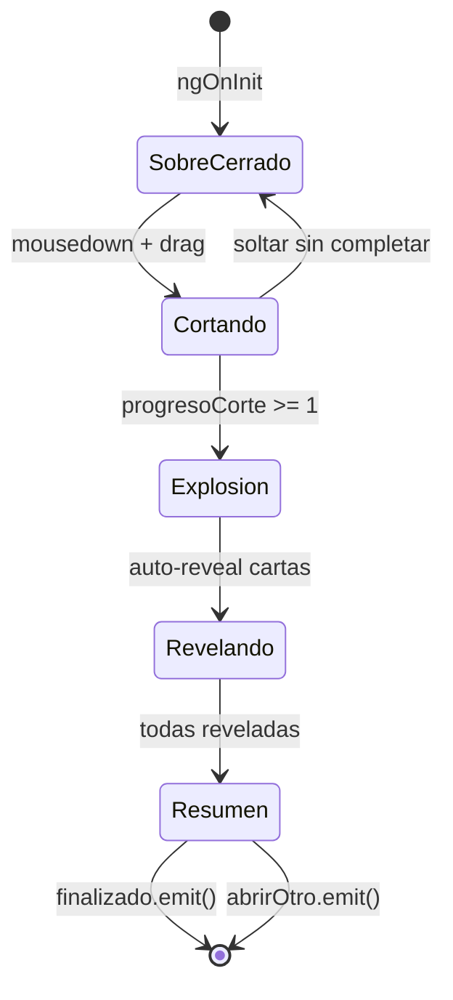

# AperturaSobreComponent - Animacion de Apertura de Sobres

> Componente 3D con Three.js que simula la apertura fisica de un sobre de cartas Pokemon

---

## Ubicacion

`frontend/src/app/features/lobby/components/apertura-sobre/apertura-sobre.ts`

---

## Componente

```typescript
@Component({
  selector: 'app-apertura-sobre',
  standalone: true,
  imports: [CommonModule],
  templateUrl: './apertura-sobre.html',
  styleUrl: './apertura-sobre.scss'
})
export class AperturaSobreComponent implements OnInit, OnDestroy
```

---

## Inputs y Outputs

| Tipo | Nombre | Tipo TS | Descripcion |
|------|--------|---------|-------------|
| `@Input` | `cartas` | `any[]` | Cartas que contiene el sobre |
| `@Input` | `sobresRestantes` | `number` | Cantidad de sobres disponibles |
| `@Output` | `finalizado` | `EventEmitter<void>` | Emite cuando la animacion termina |
| `@Output` | `abrirOtro` | `EventEmitter<void>` | Emite cuando el usuario pide abrir otro sobre |

---

## Escena 3D

La apertura se renderiza completamente en Three.js con:

```typescript
private scene!: THREE.Scene;
private camera!: THREE.PerspectiveCamera;
private renderer!: THREE.WebGLRenderer;
```

### Elementos 3D

| Elemento | Descripcion |
|----------|-------------|
| `sobreGroup` | Grupo del sobre completo |
| `sobreCuerpoMesh` | Cuerpo del sobre (mesh) |
| `sobreTapaMesh` | Tapa que se abre |
| `lineaGlow` | Linea de corte con glow |
| `mazoCartas` | Stack de cartas dentro del sobre |
| `particulasExplosion` | Efecto de particulas al abrir |
| `luzExplosion` | Luz puntual dramatica |

---

## Mecanica de Apertura

El sobre se abre con una interaccion de **arrastrar para cortar**:

```
1. MANTENER CLICK        -> Inicio de corte
2. DESLIZAR HORIZONTALMENTE -> Progresa el corte
3. COMPLETAR CORTE       -> Explosion + revelar cartas
4. REVELAR CARTAS        -> Una por una con animacion
5. RESUMEN               -> Vista de todas las cartas obtenidas
```

### Estados de Interaccion

| Propiedad | Tipo | Descripcion |
|-----------|------|-------------|
| `estaCortando` | `boolean` | En proceso de corte |
| `estaCortado` | `boolean` | Sobre abierto completamente |
| `progresoCorte` | `number` | 0-1, progreso del corte |
| `explosiónDisparada` | `boolean` | Si ya se lanzo la explosion |
| `puedePasar` | `boolean` | Si puede pasar a la siguiente carta |
| `autoRevealEnCurso` | `boolean` | Revelando cartas automaticamente |
| `resumenVisible` | `boolean` | Mostrando resumen final |

---

## Enchanted (Sobre Especial)

```typescript
public isEnchanted: boolean = false;
```

Si el sobre contiene al menos una carta rara (Rare, Epic, Legendary, Secret Rare), el sobre tiene efectos visuales especiales (glow, particulas distintas).

---

## Event Handlers

| Evento | Accion |
|--------|--------|
| `mousedown` / `touchstart` | Inicia corte |
| `mouseup` / `touchend` | Intenta completar corte o pasar carta |
| `mousemove` / `touchmove` | Progresa el corte horizontal |

---

## Ciclo de Vida

```typescript
ngOnInit(): void {
  this.isEnchanted = this.cartas.some(c => /* tiene rareza alta */);
  this.initThree();      // Inicializar escena
  this.crearSobrePro();  // Construir modelo del sobre
  this.animate();        // Loop de render
}

ngOnDestroy(): void {
  cancelAnimationFrame(this.animationId);
  this.renderer.dispose();
}
```

---

## Diagrama de Flujo


