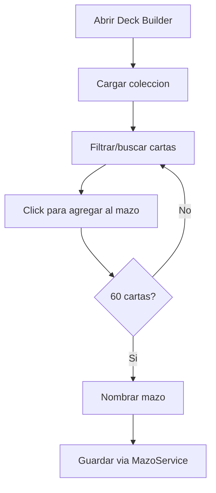
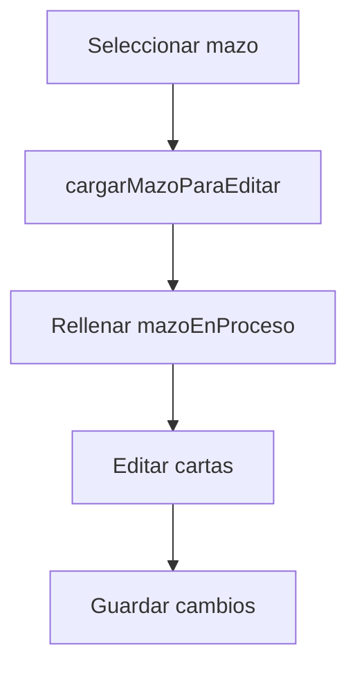

# DeckBuilderComponent - Constructor de Mazos

> Componente para buscar cartas, construir y validar mazos de 60 cartas

---

## Ubicacion

`frontend/src/app/features/deck-builder/deck-builder.component.ts`

---

## Componente

```typescript
@Component({
  selector: 'app-deck-builder',
  standalone: true,
  imports: [CommonModule, FormsModule],
  host: { '[class.embedded]': 'embedded' }
})
export class DeckBuilderComponent implements OnInit, OnChanges
```

---

## Inputs y Outputs

| Tipo | Nombre | Tipo TS | Descripcion |
|------|--------|---------|-------------|
| `@Input` | `embedded` | `boolean` | Si esta embebido dentro del lobby |
| `@Input` | `mazoInicial` | `Mazo \| null` | Mazo a editar (null = nuevo) |
| `@Input` | `mazosDisponibles` | `Mazo[]` | Lista de mazos del jugador |
| `@Output` | `closed` | `EventEmitter<boolean>` | Emite al cerrar (true si guardo) |

---

## Estado del Componente

### Datos del Mazo

```typescript
coleccion: Card[] = [];                      // Cartas disponibles
mazoEnProceso: Card[] = [];                  // Cartas en el mazo actual
cantidadesPoseidas: { [key: string]: number } = {};  // Copias de cada carta
nombreMazo: string = 'Mi Nuevo Mazo';
idMazoAEditar: number | null = null;         // null = creando nuevo
```

### Filtros

```typescript
filtroNombre: string = '';
filtroTipo: string = 'Todos';
tipos: string[] = [
  'Todos', 'Grass', 'Fire', 'Water', 'Lightning', 'Psychic',
  'Fighting', 'Darkness', 'Metal', 'Dragon', 'Colorless'
];
```

### Vistas

```typescript
vistaDeckBuilder: 'library' | 'editor' = 'editor';
```

- **library**: Lista de mazos guardados
- **editor**: Editor visual del mazo

---

## Inspeccion de Cartas

```typescript
showInspeccion: boolean = false;
cardFocus: Card | null = null;
hoverTimer: any;
```

Al mantener hover sobre una carta, muestra un zoom con detalles completos.

---

## Preload de Imagenes

```typescript
isLoadingImages: boolean = true;
loadingProgress: number = 0;
```

Precarga hasta 18 imagenes unicas al iniciar para evitar pop-in.

---

## Flujo de Uso

### Crear Mazo Nuevo



### Editar Mazo Existente



---

## Servicios Usados

| Servicio | Uso |
|----------|-----|
| `JugadorService` | Cargar coleccion del jugador |
| `MazoService` | CRUD de mazos (HTTP) |
| `ImagePreloaderService` | Precarga de imagenes |
| `I18nService` | Traducciones |

---

## Mapa de Fotos Legacy

```typescript
mapaFotos: { [key: string]: string } = {
    'p1': 'base1-1', 'p2': 'base3-1', ...
};
```

Mapea IDs viejos del sistema a IDs reales del catalogo para cartas con imagenes actualizadas.

---

## Validacion de Mazo

Reglas aplicadas:
- **60 cartas exactas**: Obligatorio
- **Maximo 4 copias**: De la misma carta
- **Stock disponible**: No se puede agregar mas copias de las que se poseen
