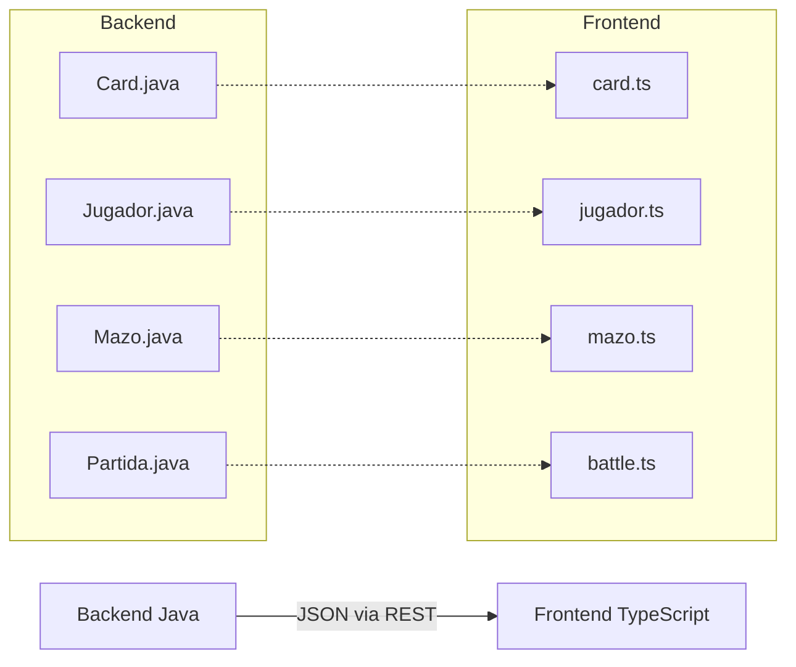

# Shared Models - Modelos Compartidos del Frontend

> Interfaces TypeScript que definen la estructura de datos compartida entre componentes

---

## Ubicacion

`frontend/src/app/shared/models/`

---

## Archivos

| Archivo | Descripcion |
|---------|-------------|
| `card.ts` | Modelo de carta Pokemon |
| `jugador.ts` | Modelo de jugador |
| `mazo.ts` | Modelo de mazo |
| `battle.ts` | Modelos de batalla (Partida, CartaEnJuego, etc.) |

---

## Card

**Archivo**: `shared/models/card.ts`

Espejea la entidad `Card` del backend.

```typescript
export interface Card {
  id: string;           // ID del catalogo (ej: "base1-1")
  nombre: string;
  hp: string;
  tipo: string;         // Tipo de energia (Fire, Water, etc.)
  imagen: string;       // URL de la imagen
  supertype: string;    // "Pokemon", "Trainer", "Energy"
  subtypes: string[];   // ["Basic"], ["Stage 1"], ["EX"], etc.
  evolvesFrom?: string; // Nombre del Pokemon anterior
  ataques: Ataque[];
  debilidades: CardAttribute[];
  resistencias: CardAttribute[];
  costoRetirada: string[];
  reglas: string[];
  rarity?: string;
}
```

---

## Jugador

**Archivo**: `shared/models/jugador.ts`

```typescript
export interface Jugador {
  id: number;
  username: string;
  email?: string;
  sobresDisponibles: number;
  coleccion: Card[];
  mazos: Mazo[];
  // Personalizacion del avatar
  characterId?: string;
  skinColor?: string;
  hairColor?: string;
  eyeColor?: string;
  height?: number;
  pikachuEnabled?: boolean;
}
```

---

## Mazo

**Archivo**: `shared/models/mazo.ts`

```typescript
export interface Mazo {
  id: number;
  nombre: string;
  cartas: Card[];
}
```

---

## Battle Models

**Archivo**: `shared/models/battle.ts`

### Partida

```typescript
export interface Partida {
  id: string;
  jugador: TableroJugador;
  bot: TableroJugador;
  turnoActual: 'JUGADOR' | 'BOT';
  faseActual: string;
  numeroTurno: number;
  ganador?: string;
  razonFinPartida?: string;
  // Coin flip
  coinFlipped: boolean;
  coinFlipWinner?: string;
  coinFlipResult?: string;
  // Mulligan
  mulligansJugador: number;
  mulligansBot: number;
  // Logs
  turnLogs: string[];
  ultimasMonedasLanzadas: boolean[];
}
```

### TableroJugador

```typescript
export interface TableroJugador {
  mazo: Card[];
  mano: Card[];
  premios: Card[];
  activo: CartaEnJuego | null;
  banca: CartaEnJuego[];
  pilaDescarte: Card[];
}
```

### CartaEnJuego

```typescript
export interface CartaEnJuego {
  card: Card;
  hpActual: number;
  energiasUnidas: Card[];
  condicionesEspeciales: string[];
  puedeAtacar: boolean;
  invulnerable: boolean;
  bocaAbajo: boolean;
}
```

---

## Relacion Backend-Frontend



Los modelos del frontend son espejos de las entidades del backend. La serializacion JSON de Spring Boot mapea automaticamente los campos Java a las interfaces TypeScript.
