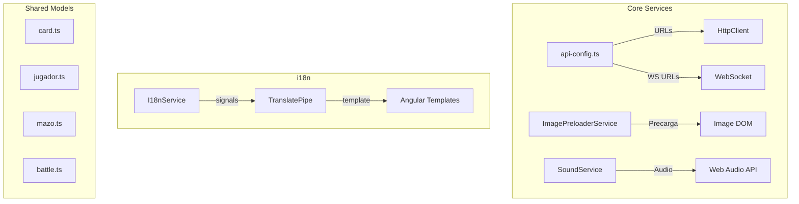

# Hooks, Pipes & Utilidades del Frontend

> Servicios utilitarios, pipes de traduccion y helpers compartidos

---

## Core Services (Utilidades)

### api-config.ts

**Archivo**: `core/services/api-config.ts`

Funciones para resolver URLs dinamicamente segun el entorno.

```typescript
export function getBackendUrl(): string {
  // Local: http://{host}:8080
  // Produccion: https://pokemontcg-gi68.onrender.com
}

export function getWsUrl(): string {
  // Convierte HTTP a WS (ws:// o wss://)
}
```

**Logica de deteccion de entorno**:
- Si hay puerto en la URL o el host es localhost/IP privada -> entorno local (puerto 8080)
- Si no -> URL de produccion hardcodeada

---

### ImagePreloaderService

**Archivo**: `core/services/image-preloader.service.ts`

Precarga imagenes de cartas antes de mostrar la UI.

```typescript
@Injectable({ providedIn: 'root' })
export class ImagePreloaderService {
  preloadImages(urls: string[]): Observable<number>
}
```

| Metodo | Parametros | Retorno | Descripcion |
|--------|-----------|---------|-------------|
| `preloadImages` | `string[]` URLs | `Observable<number>` (0-100%) | Carga imagenes y emite progreso |

**Comportamiento**:
- Crea elementos `Image()` del DOM para forzar la carga
- Emite porcentaje de progreso (0-100)
- Cuenta errores como carga exitosa para no bloquear

---

### SoundService

**Archivo**: `core/services/sound.service.ts`

Motor de sonido basado en Web Audio API para efectos de juego.

```typescript
@Injectable({ providedIn: 'root' })
export class SoundService {
  private ctx: AudioContext | null = null;
  private masterGain: GainNode | null = null;
  private muted = false;
}
```

**Caracteristicas**:
- Usa `AudioContext` para generar sonidos procedurales
- Master gain a 35% por defecto
- Auto-resume en primera interaccion del usuario (politica de navegadores)
- Soporte de mute global

---

## Sistema de Internacionalizacion (i18n)

### I18nService

**Archivo**: `i18n/i18n.service.ts`

Servicio de traduccion multi-idioma con Angular Signals.

```typescript
@Injectable()
export class I18nService {
  // Idiomas soportados
  type LanguageCode = 'en' | 'es' | 'pt' | 'ja';
}
```

| Idioma | Codigo | Nombre Nativo |
|--------|--------|---------------|
| English | `en` | English |
| Spanish | `es` | Espanol |
| Portuguese | `pt` | Portugues |
| Japanese | `ja` | 日本語 |

Las traducciones se almacenan como `Record<LanguageCode, Record<string, string>>` en el mismo archivo (sin archivos JSON externos).

---

### TranslatePipe

**Archivo**: `i18n/translate.pipe.ts`

Pipe para usar traducciones directamente en templates.

```typescript
@Pipe({
  name: 't',
  standalone: true,
  pure: false   // Impure para reaccionar a cambios de idioma
})
export class TranslatePipe implements PipeTransform {
  transform(key: string, params?: Record<string, any>): string {
    return this.i18n.translate(key, params);
  }
}
```

**Uso en templates**:
```html
{{ 'login.enterArena' | t }}
{{ 'battle.damage' | t: { amount: 30 } }}
```

---

## Resumen de Arquitectura



---

## Nota sobre Hooks

Este proyecto usa **Angular** (no React), por lo que no tiene custom hooks. El equivalente son los **servicios inyectables** (`@Injectable`) que encapsulan logica reutilizable y se comparten via dependency injection.
