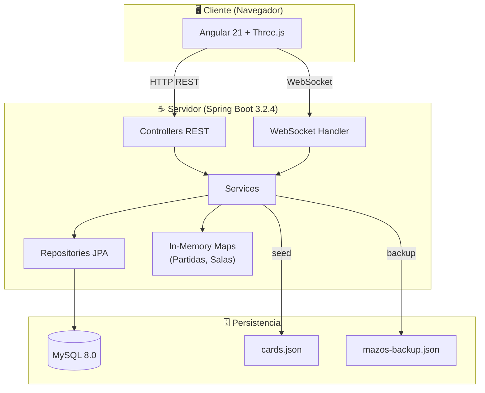
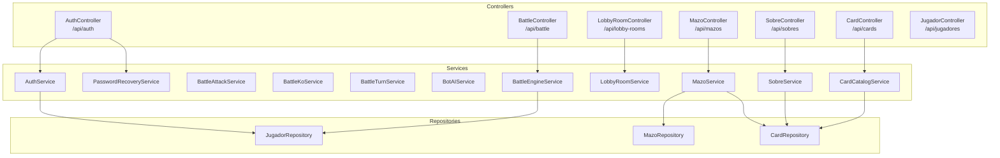
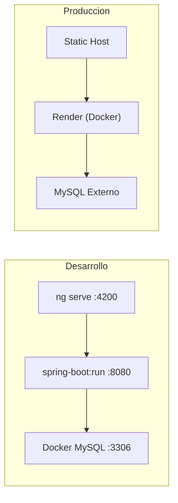

# Arquitectura General del Sistema

> Vista completa de la arquitectura full-stack del Pokemon TCG

---

## Vista de Alto Nivel



---

## Stack Tecnologico

### Backend

| Tecnologia | Version | Uso |
|------------|---------|-----|
| Java | 21 LTS | Lenguaje principal |
| Spring Boot | 3.2.4 | Framework web |
| Spring Data JPA | 3.2.x | ORM / Persistencia |
| Hibernate | 6.x | Implementacion JPA |
| MySQL | 8.0 | Base de datos |
| Spring WebSocket | 3.2.x | Comunicacion real-time |
| Spring Mail | 3.2.x | Envio de emails |
| SpringDoc OpenAPI | 2.3.0 | Documentacion Swagger |
| Maven | 3.9.6 | Build tool |

### Frontend

| Tecnologia | Version | Uso |
|------------|---------|-----|
| Angular | 21.2 | Framework SPA |
| TypeScript | 5.x | Lenguaje |
| Three.js | 0.183 | Graficos 3D (lobby, sobres, batalla) |
| RxJS | 7.8 | Programacion reactiva |
| SCSS | - | Estilos |
| Web Audio API | Nativa | Efectos de sonido procedurales |

---

## Capas del Backend



---

## Comunicacion Frontend-Backend

```mermaid
graph LR
    subgraph Frontend
        LOGIN[LoginComponent]
        LOBBY[LobbyComponent]
        BATTLE[BattleBoardComponent]
        DECK[DeckBuilderComponent]
    end

    subgraph "REST API (HTTP)"
        AUTH[/api/auth]
        BAPI[/api/battle]
        LAPI[/api/lobby-rooms]
        MAPI[/api/mazos]
        SAPI[/api/sobres]
    end

    subgraph "WebSocket"
        WSLOBBY[/lobby-ws]
    end

    LOGIN --> AUTH
    LOBBY --> LAPI
    LOBBY --> SAPI
    LOBBY --> MAPI
    LOBBY --> WSLOBBY
    BATTLE --> BAPI
    DECK --> MAPI
```

---

## Datos In-Memory vs Persistidos

| Dato | Almacenamiento | Razon |
|------|---------------|-------|
| Jugadores, Cartas, Mazos | MySQL (JPA) | Datos permanentes |
| Partidas activas | `ConcurrentHashMap` | Baja latencia en tiempo real |
| Salas del lobby | `ConcurrentHashMap` | Efimeras, no necesitan persistencia |
| Posiciones de jugadores (lobby 3D) | WebSocket (memoria) | Datos de sesion |
| Backup de mazos | Archivo JSON | Proteccion ante reinicios |
| Catalogo de cartas | cards.json + MySQL | Seed inicial desde JSON |

---

## Deployment


