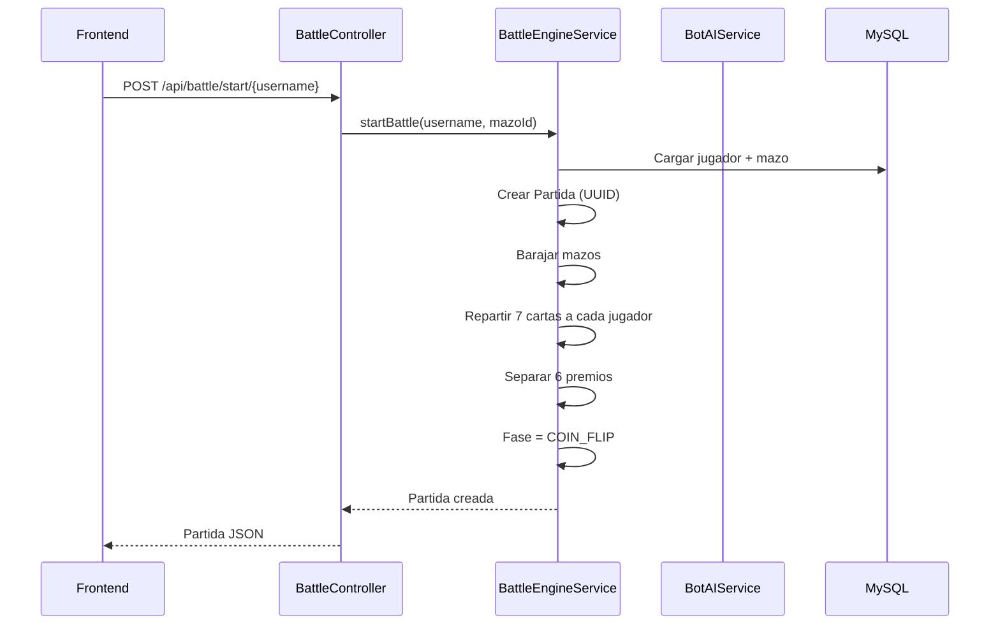
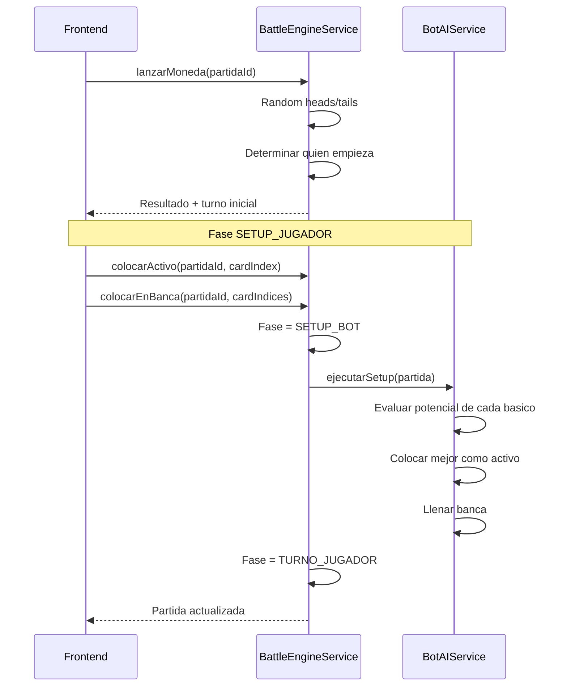
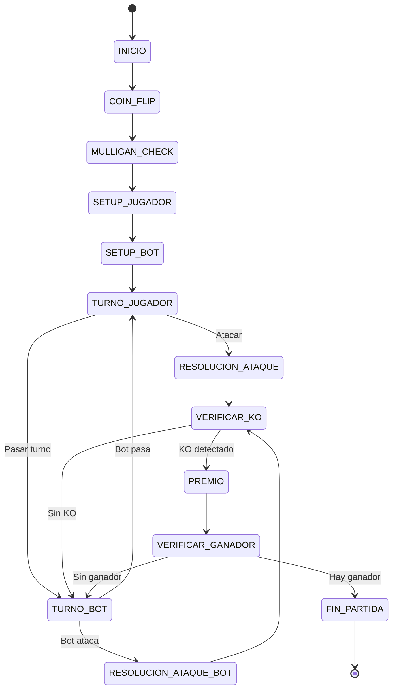
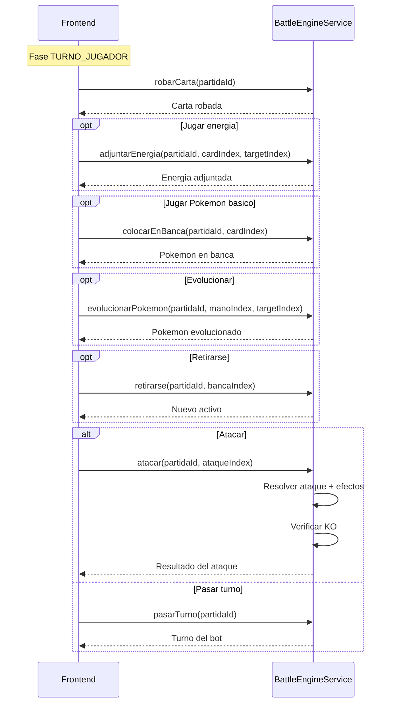
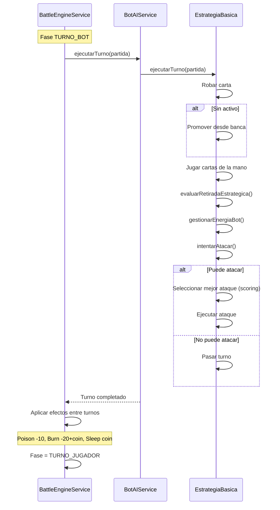
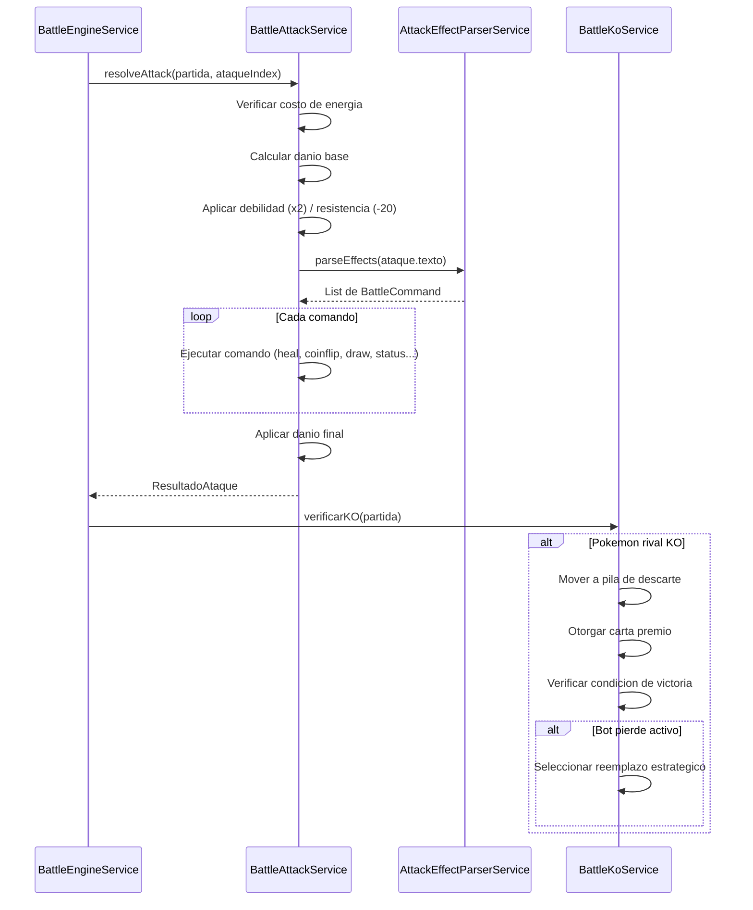
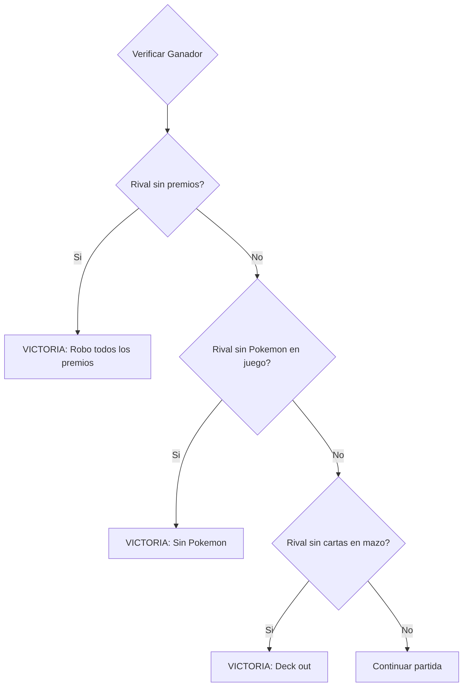

# Flujo de Batalla - Diagramas de Secuencia

> Ciclo completo de una batalla Pokemon desde inicio hasta fin

---

## Inicio de Batalla

---

## Coin Flip y Setup

---

## Maquina de Estados (Fases)

---

## Turno del Jugador

---

## Turno del Bot

---

## Resolucion de Ataque

---

## Condiciones de Victoria

