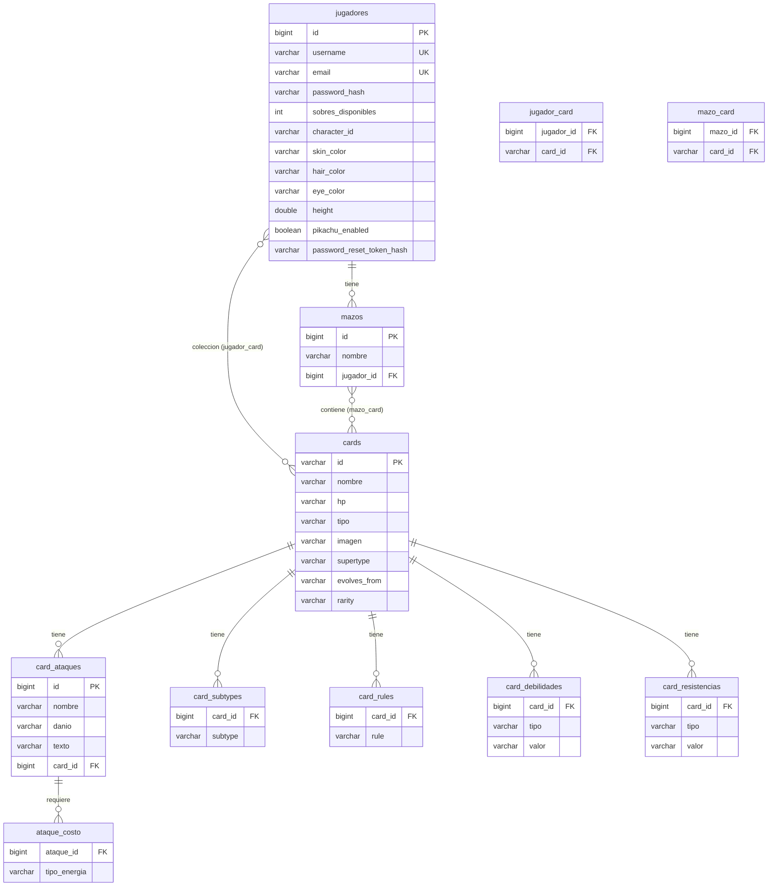
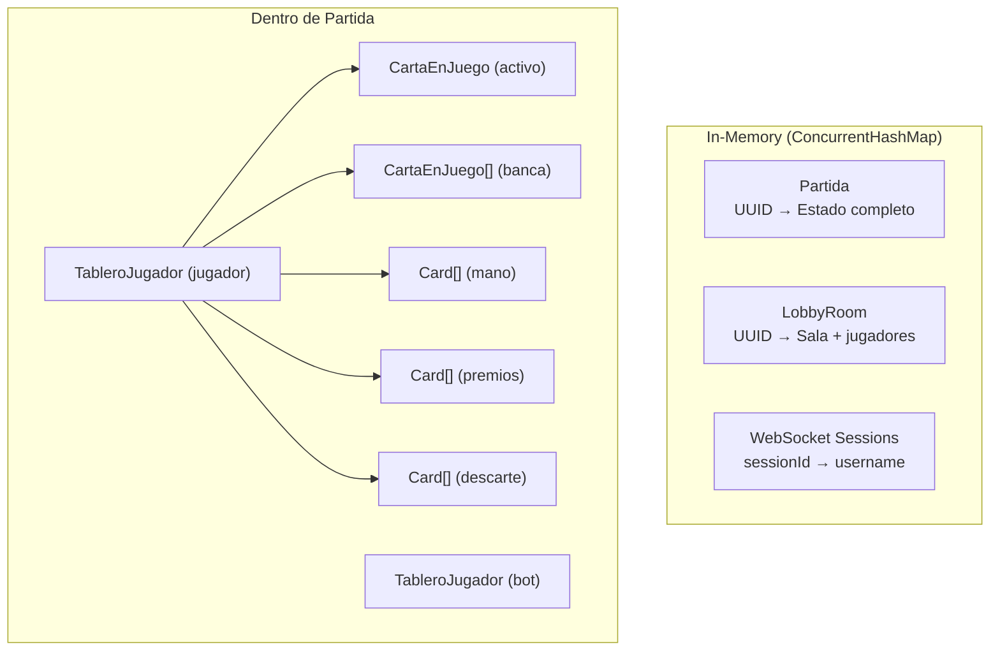

# Modelo de Datos - Diagrama ER

> Esquema completo de la base de datos generado por Hibernate/JPA

---

## Diagrama Entidad-Relacion

---

## Tablas Principales

### jugadores

Almacena los datos del jugador y su perfil de avatar.

| Columna | Tipo | Constraint | Descripcion |
|---------|------|-----------|-------------|
| `id` | BIGINT | PK, AUTO | ID generado |
| `username` | VARCHAR | UNIQUE | Nombre de usuario |
| `email` | VARCHAR | UNIQUE | Email para recovery |
| `password_hash` | VARCHAR | | SHA-256 del password |
| `sobres_disponibles` | INT | | Sobres por abrir |
| `character_id` | VARCHAR | | Modelo 3D elegido |
| `skin_color` | VARCHAR | | Color de piel (hex) |
| `hair_color` | VARCHAR | | Color de pelo (hex) |
| `eye_color` | VARCHAR | | Color de ojos (hex) |
| `height` | DOUBLE | | Altura del avatar |
| `pikachu_enabled` | BOOLEAN | | Mostrar Pikachu mascota |
| `password_reset_token_hash` | VARCHAR | | Token temporal de recovery |

### cards

Catalogo de cartas Pokemon del set XY.

| Columna | Tipo | Constraint | Descripcion |
|---------|------|-----------|-------------|
| `id` | VARCHAR | PK | ID del catalogo (ej: "xy1-1") |
| `nombre` | VARCHAR | | Nombre de la carta |
| `hp` | VARCHAR | | Puntos de vida |
| `tipo` | VARCHAR | | Tipo de energia |
| `imagen` | VARCHAR | | URL de la imagen |
| `supertype` | VARCHAR | | Pokemon / Energy |
| `evolves_from` | VARCHAR | | Pokemon previo |
| `rarity` | VARCHAR | | Rareza |

### mazos

Mazos de 60 cartas de cada jugador.

| Columna | Tipo | Constraint | Descripcion |
|---------|------|-----------|-------------|
| `id` | BIGINT | PK, AUTO | ID generado |
| `nombre` | VARCHAR | | Nombre del mazo |
| `jugador_id` | BIGINT | FK | Dueno del mazo |

---

## Tablas de Relacion

### jugador_card (Coleccion)

Relacion `@ManyToMany` entre Jugador y Card. Un jugador puede tener multiples copias de la misma carta.

### mazo_card (Cartas del Mazo)

Relacion `@ManyToMany` entre Mazo y Card. Siempre contiene exactamente 60 registros por mazo.

---

## Tablas de Coleccion (ElementCollection)

Estas tablas almacenan listas de valores simples asociados a una entidad padre:

| Tabla | Padre | Contenido |
|-------|-------|-----------|
| `card_subtypes` | Card | Subtipos: "Basic", "Stage 1", "EX" |
| `card_rules` | Card | Reglas especiales de la carta |
| `card_debilidades` | Card | Debilidades (tipo + valor) |
| `card_resistencias` | Card | Resistencias (tipo + valor) |
| `ataque_costo` | Ataque | Tipos de energia requeridos |

---

## Datos In-Memory (No Persistidos)

Estos datos viven en `ConcurrentHashMap` durante la ejecucion:

---

## Estrategia DDL

| Entorno | `ddl-auto` | Efecto |
|---------|-----------|--------|
| Desarrollo | `update` | Crea/modifica tablas automaticamente |
| Produccion | `validate` (recomendado) | Solo valida, no modifica |
