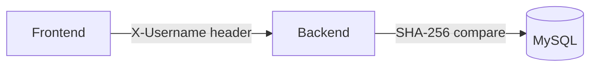
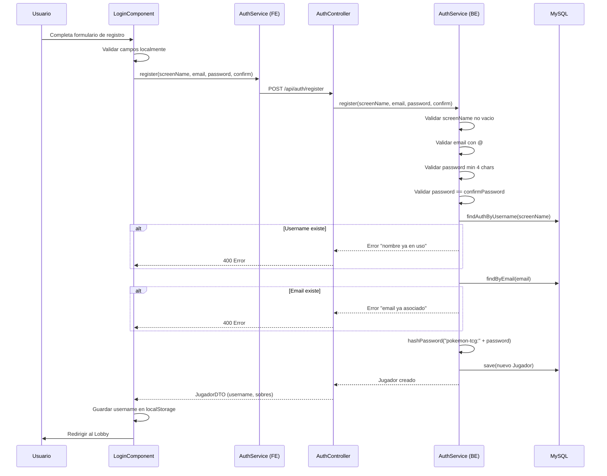
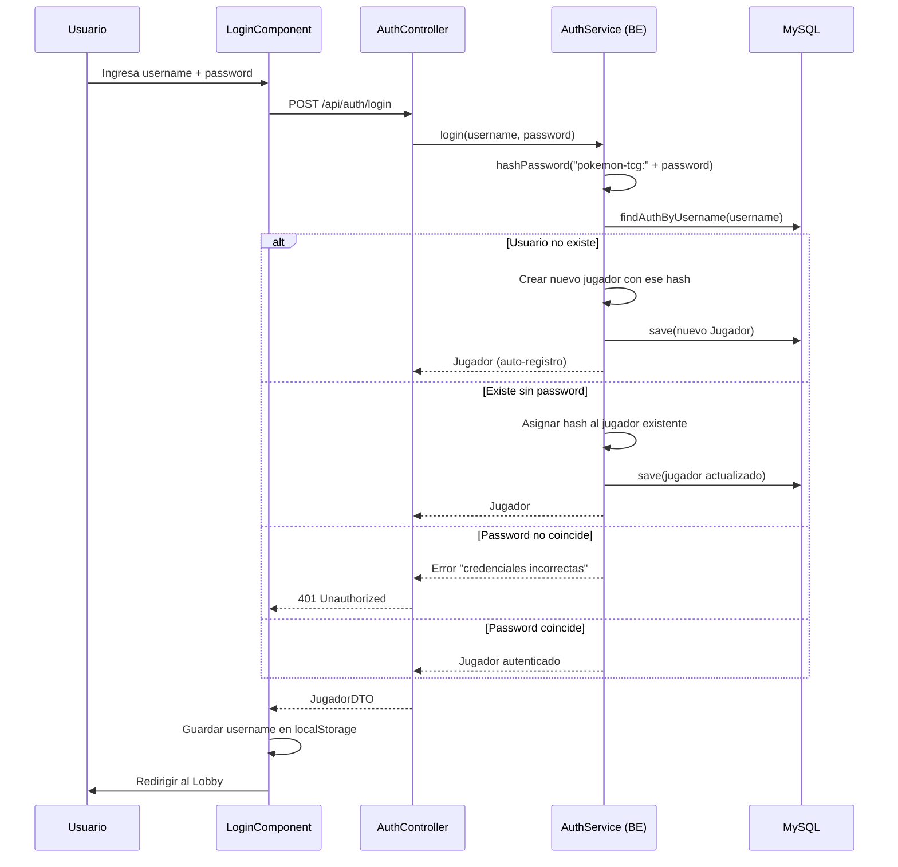
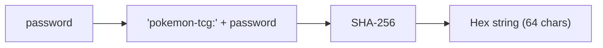
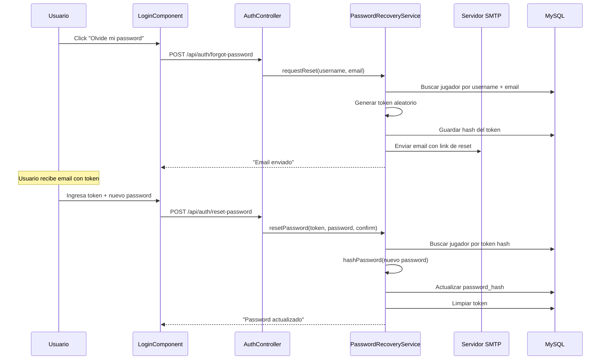
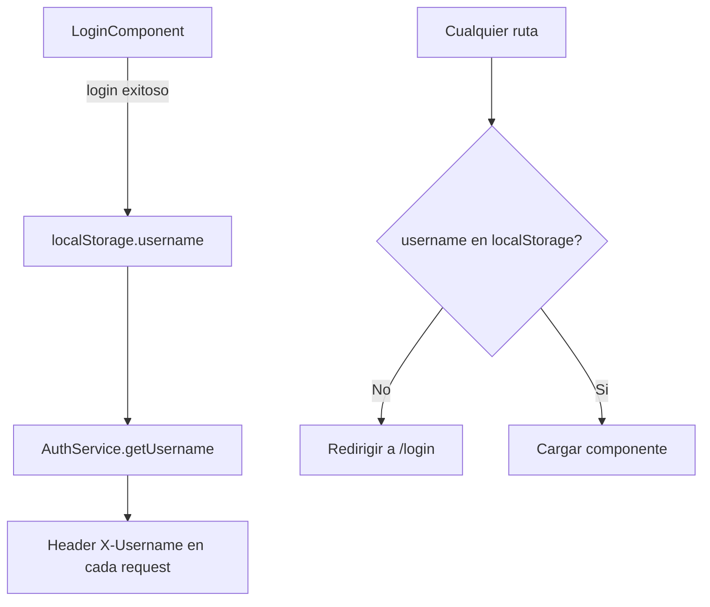

# Flujo de Autenticacion

> Registro, login y recuperacion de password

---

## Arquitectura de Auth

El sistema usa **autenticacion basada en SHA-256** sin JWT ni sesiones del servidor. El username se envia como header `X-Username` en cada request.



---

## Registro



---

## Login



**Nota**: El login tiene auto-registro: si el username no existe, crea la cuenta automaticamente.

---

## Hashing de Password



```java
// Salt fijo: "pokemon-tcg:"
MessageDigest.getInstance("SHA-256")
    .digest(("pokemon-tcg:" + password).getBytes(UTF_8))
```

No usa bcrypt ni salt aleatorio. El prefijo `"pokemon-tcg:"` actua como salt estatico.

---

## Recuperacion de Password



---

## Endpoints de Auth

| Metodo | Endpoint | Descripcion |
|--------|----------|-------------|
| POST | `/api/auth/login` | Login (con auto-registro) |
| POST | `/api/auth/register` | Registro explicito |
| POST | `/api/auth/forgot-password` | Solicitar reset |
| POST | `/api/auth/reset-password` | Cambiar password con token |

---

## Seguridad del Frontend



El frontend almacena el username en `localStorage` y lo incluye como header en cada request HTTP. No hay JWT ni tokens de sesion.
