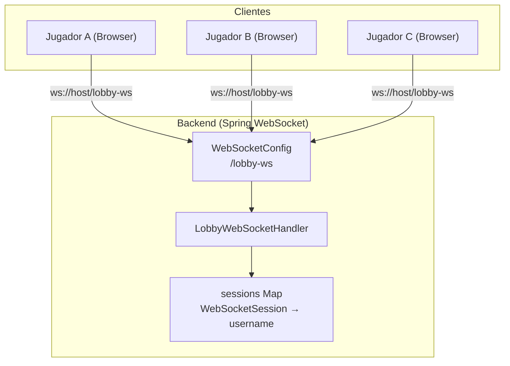
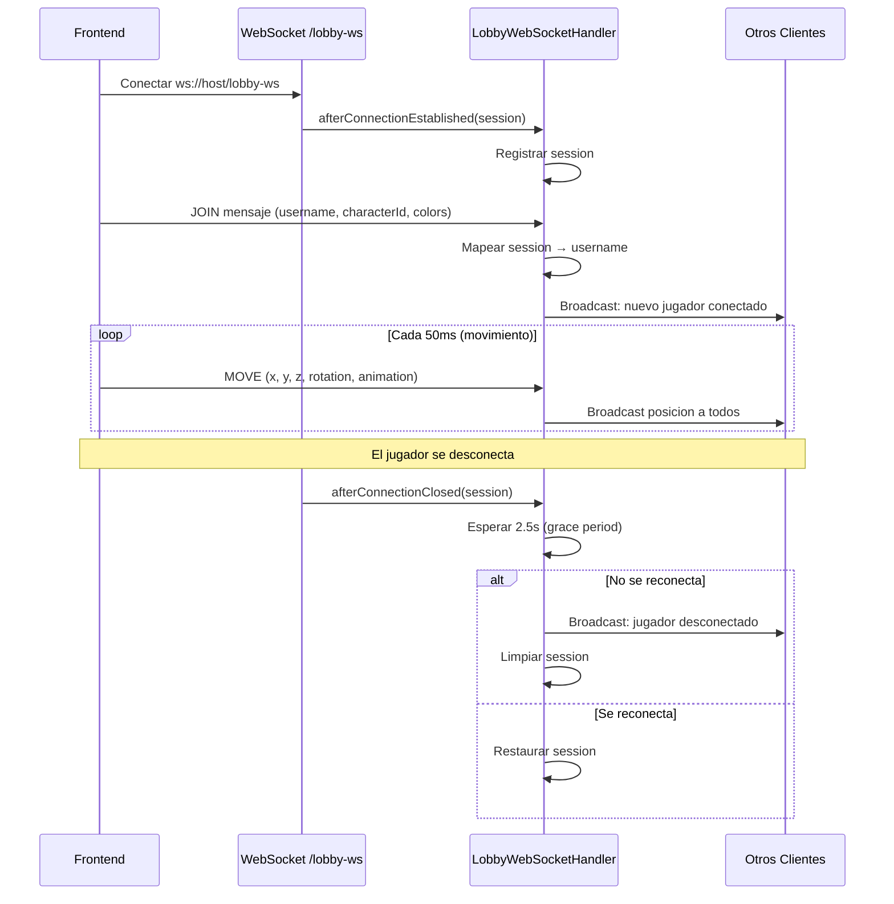
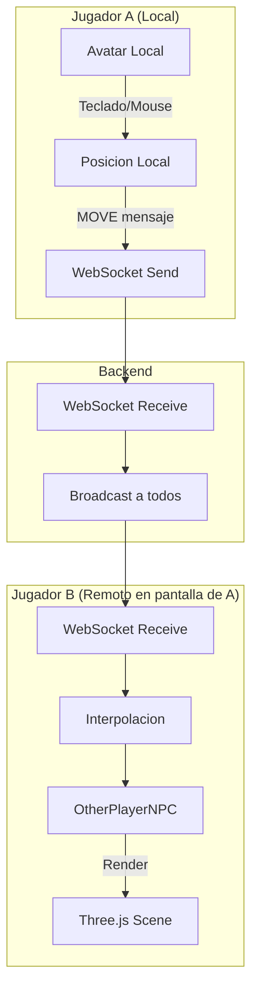
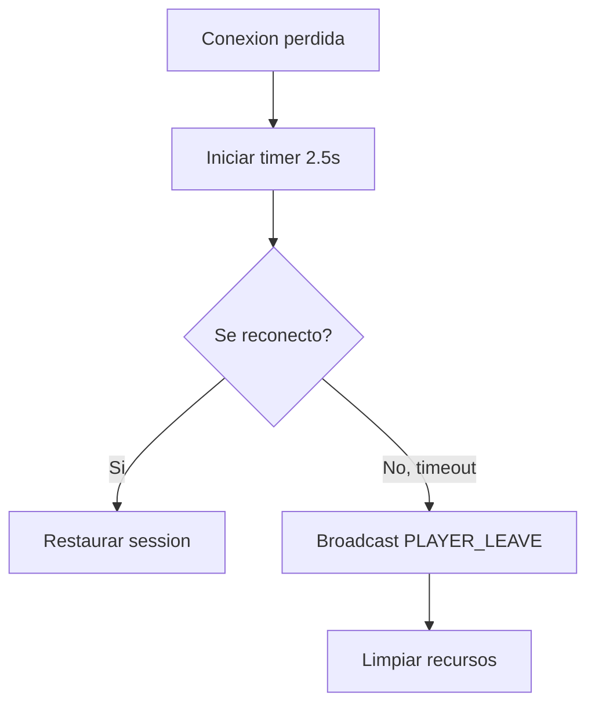
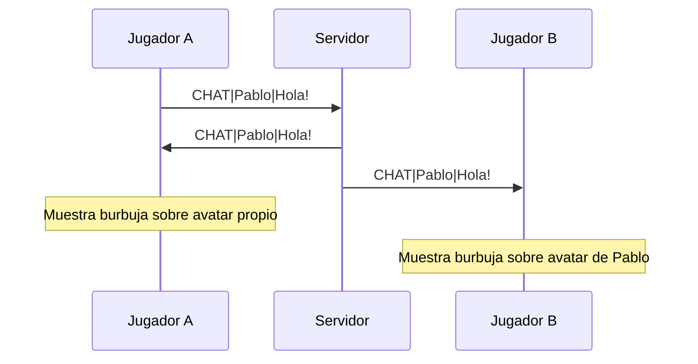

# Flujo WebSocket - Lobby Multiplayer

> Conexion WebSocket para sincronizar jugadores en el lobby 3D

---

## Arquitectura WebSocket



---

## Ciclo de Conexion



---

## Tipos de Mensaje

Todos los mensajes se envian como texto plano con formato `TIPO|payload`.

### Cliente a Servidor

| Tipo | Formato | Descripcion |
|------|---------|-------------|
| `JOIN` | `JOIN\|username\|characterId\|skinColor\|hairColor\|eyeColor` | Unirse al lobby |
| `MOVE` | `MOVE\|x\|y\|z\|rotationY\|animation` | Actualizar posicion |
| `CHAT` | `CHAT\|username\|mensaje` | Enviar mensaje de chat |
| `EMOTE` | `EMOTE\|username\|emoteId` | Enviar emote |
| `CHALLENGE` | `CHALLENGE\|fromUser\|toUser` | Desafiar a otro jugador |

### Servidor a Cliente (Broadcast)

| Tipo | Formato | Descripcion |
|------|---------|-------------|
| `PLAYER_JOIN` | `PLAYER_JOIN\|username\|characterId\|colors...` | Nuevo jugador en el lobby |
| `PLAYER_MOVE` | `PLAYER_MOVE\|username\|x\|y\|z\|rotY\|anim` | Posicion actualizada |
| `PLAYER_LEAVE` | `PLAYER_LEAVE\|username` | Jugador salio del lobby |
| `CHAT` | `CHAT\|username\|mensaje` | Mensaje de chat |
| `EMOTE` | `EMOTE\|username\|emoteId` | Emote recibido |
| `CHALLENGE` | `CHALLENGE\|fromUser\|toUser` | Desafio recibido |

---

## Sincronizacion de Jugadores



### Interpolacion

Los jugadores remotos no se teletransportan. El frontend usa **interpolacion lineal** para suavizar el movimiento:

```typescript
// Cada frame de render
otherPlayer.root.position.lerp(otherPlayer.targetPosition, 0.15);
```

---

## Grace Period de Desconexion



El grace period de **2.5 segundos** evita que recargas rapidas de pagina o micro-desconexiones muestren al jugador saliendo y entrando.

---

## Chat y Burbujas



Los mensajes de chat aparecen como **burbujas 3D** flotando sobre el avatar del jugador que los envio, visibles para todos los jugadores en el lobby.

---

## Configuracion del Servidor

**Archivo**: `config/WebSocketConfig.java`

```java
@Configuration
@EnableWebSocket
public class WebSocketConfig implements WebSocketConfigurer {
    @Override
    public void registerWebSocketHandlers(WebSocketHandlerRegistry registry) {
        registry.addHandler(lobbyWebSocketHandler(), "/lobby-ws")
                .setAllowedOrigins("*");
    }
}
```

- Endpoint: `/lobby-ws`
- CORS: Abierto (`*`)
- Protocolo: WebSocket nativo (no STOMP ni SockJS)
