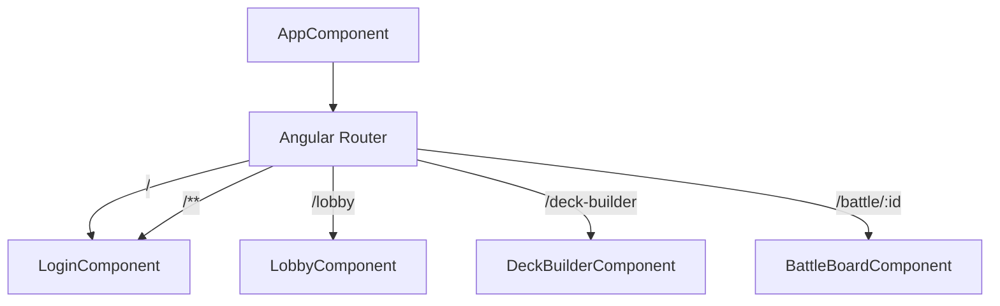
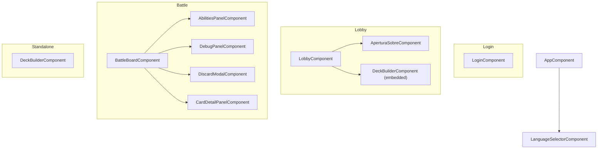
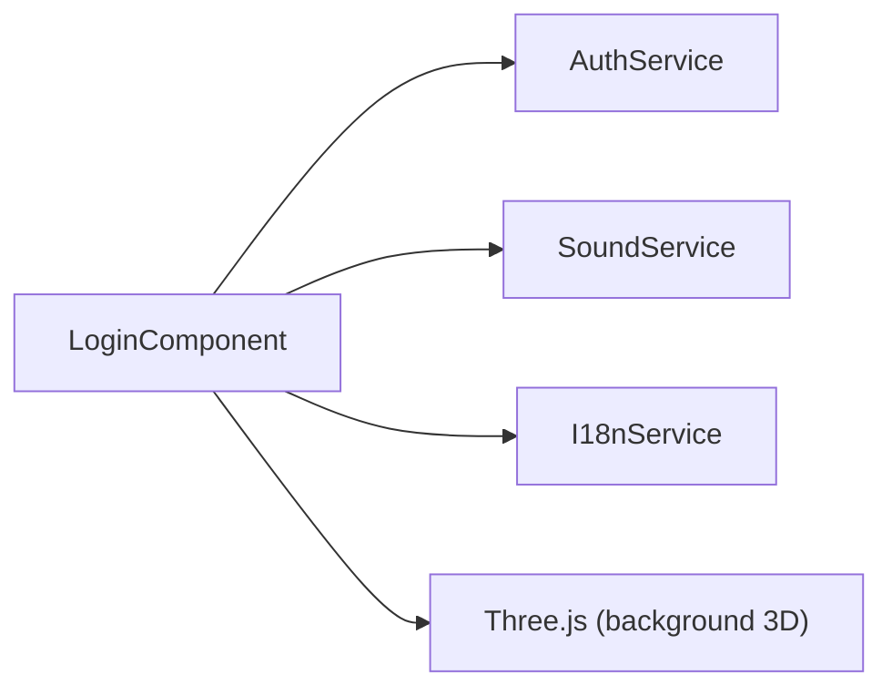
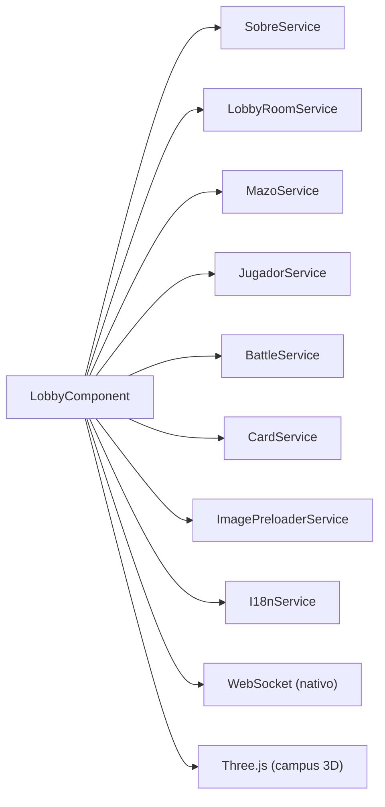
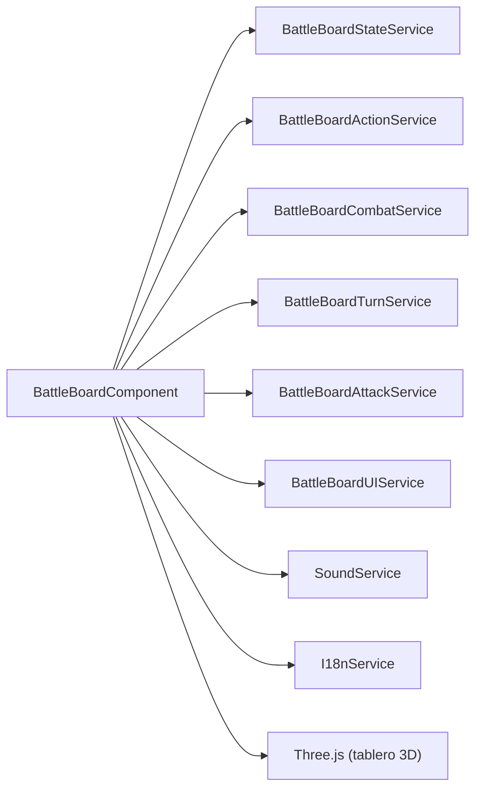
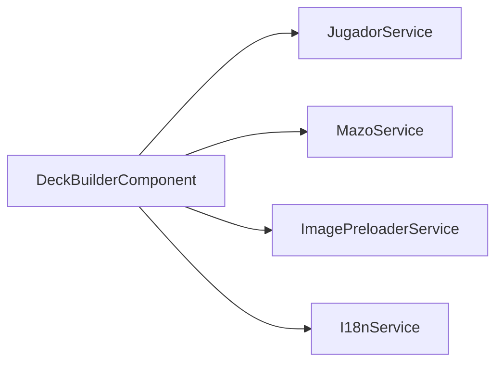
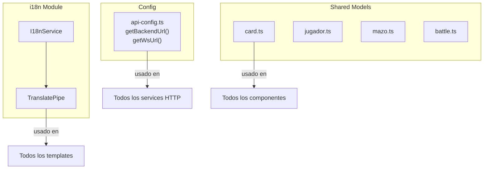

# Componentes y Dependencias

> Arbol de componentes Angular y sus servicios inyectados

---

## Rutas de la Aplicacion

| Ruta | Componente | Descripcion |
|------|-----------|-------------|
| `/` | Redirect a `/login` | - |
| `/login` | `LoginComponent` | Pantalla de login/registro |
| `/lobby` | `LobbyComponent` | Campus 3D multiplayer |
| `/deck-builder` | `DeckBuilderComponent` | Constructor de mazos |
| `/battle/:id` | `BattleBoardComponent` | Tablero de batalla |
| `/**` | Redirect a `/login` | Ruta no encontrada |

---

## Arbol de Componentes

---

## Servicios por Componente

### LoginComponent

### LobbyComponent

### BattleBoardComponent

### DeckBuilderComponent

---

## Servicios - Capas

```mermaid
graph TD
    subgraph "Core Services (Singleton)"
        AS[AuthService]
        SS[SoundService]
        IPS[ImagePreloaderService]
        I18N[I18nService]
        JS[JugadorService]
        CS[CardService]
    end

    subgraph "Feature Services"
        subgraph Lobby
            SOS[SobreService]
            LRS[LobbyRoomService]
        end
        subgraph Battle
            BService[BattleService]
            BBS[BattleBoardStateService]
            BBA[BattleBoardActionService]
            BBC[BattleBoardCombatService]
            BBT[BattleBoardTurnService]
            BBATK[BattleBoardAttackService]
            BBUI[BattleBoardUIService]
        end
        subgraph "Deck Builder"
            MS[MazoService]
        end
    end

    subgraph "External"
        HTTP["HttpClient (REST)"]
        WS["WebSocket (nativo)"]
        WAA["Web Audio API"]
        THREEJS["Three.js"]
    end

    AS --> HTTP
    JS --> HTTP
    CS --> HTTP
    SOS --> HTTP
    LRS --> HTTP
    MS --> HTTP
    BService --> HTTP
    SS --> WAA
```

---

## Pipes y Utilidades Compartidas

---

## Dependencias Externas Clave

| Dependencia | Version | Componentes que la usan |
|-------------|---------|------------------------|
| `three` | 0.183 | Login, Lobby, AperturaSobre, BattleBoard |
| `@angular/cdk` | 21.2 | Drag & Drop en batalla |
| `rxjs` | 7.8 | Todos los servicios HTTP |
| `@angular/forms` | 21.2 | Login, DeckBuilder |
