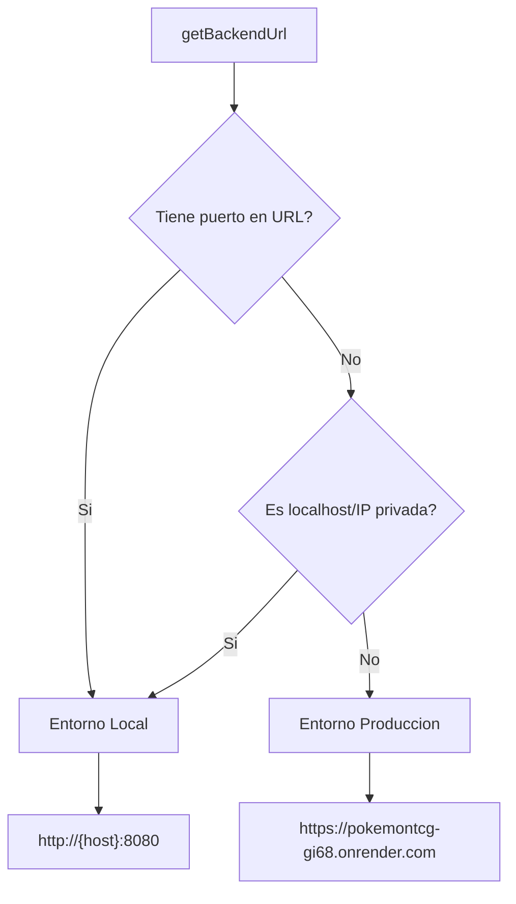

# Variables de Entorno

> Configuracion de entorno para backend y frontend

---

## Backend (application.properties)

**Archivo**: `backend/src/main/resources/application.properties`

Todas las variables usan la sintaxis `${VAR:default}` de Spring Boot, permitiendo override via variables de entorno del sistema.

### Servidor

| Variable | Default | Descripcion |
|----------|---------|-------------|
| `PORT` | `8080` | Puerto del servidor Tomcat |

```properties
server.port=${PORT:8080}
```

### Base de Datos (MySQL)

| Variable | Default | Descripcion |
|----------|---------|-------------|
| `DB_URL` | `jdbc:mysql://localhost:3306/pokemon_tcg?...` | URL JDBC de conexion |
| `DB_USERNAME` | `root` | Usuario de la base de datos |
| `DB_PASSWORD` | *(vacio)* | Password de la base de datos |
| `DB_DDL_AUTO` | `update` | Estrategia de esquema Hibernate |

```properties
spring.datasource.url=${DB_URL:jdbc:mysql://localhost:3306/pokemon_tcg?createDatabaseIfNotExist=true&useSSL=false&allowPublicKeyRetrieval=true&serverTimezone=UTC}
spring.datasource.driver-class-name=com.mysql.cj.jdbc.Driver
spring.datasource.username=${DB_USERNAME:root}
spring.datasource.password=${DB_PASSWORD:}
spring.jpa.hibernate.ddl-auto=${DB_DDL_AUTO:update}
```

### JPA / Hibernate (Optimizacion)

```properties
spring.jpa.show-sql=false
spring.jpa.properties.hibernate.format_sql=false
spring.jpa.properties.hibernate.jdbc.batch_size=50
spring.jpa.properties.hibernate.order_inserts=true
spring.jpa.properties.hibernate.order_updates=true
```

- **batch_size=50**: Agrupa hasta 50 inserts/updates en un solo batch SQL
- **order_inserts/updates**: Ordena operaciones para maximizar eficiencia del batch

### Email (SMTP)

| Variable | Default | Descripcion |
|----------|---------|-------------|
| `MAIL_HOST` | `smtp.gmail.com` | Servidor SMTP |
| `MAIL_PORT` | `587` | Puerto SMTP (TLS) |
| `MAIL_USERNAME` | *(vacio)* | Email del remitente |
| `MAIL_PASSWORD` | *(vacio)* | App Password (NO la clave de Gmail) |
| `MAIL_ENABLED` | `false` | Habilitar envio de emails |
| `MAIL_FROM` | `$MAIL_USERNAME` | Direccion del remitente |
| `MAIL_DEV_TOKEN_RESPONSE` | `false` | Devolver token en response (solo dev) |

### Frontend URLs

| Variable | Default | Descripcion |
|----------|---------|-------------|
| `FRONTEND_RESET_URL` | `http://localhost:4200/login` | URL de reset de password |

### Backup de Mazos

| Variable | Default | Descripcion |
|----------|---------|-------------|
| `app.mazos.backup-path` | `data/mazos-backup.json` | Ruta del archivo de backup |

---

## Frontend (api-config.ts)

**Archivo**: `frontend/src/app/core/services/api-config.ts`

El frontend NO usa archivos `.env`. La deteccion de entorno es automatica basada en la URL del navegador.

### Logica de Deteccion



### Deteccion de Entorno Local

Se considera local si cumple alguna de estas condiciones:
- La URL tiene un puerto (`window.location.port` no vacio)
- El host es `localhost` o `127.0.0.1`
- El host empieza con `192.168.`, `10.`, o `172.16.`
- El host termina en `.local`

### WebSocket

`getWsUrl()` convierte el protocolo HTTP a WS automaticamente:
- `http://` a `ws://`
- `https://` a `wss://`

---

## Configuracion por Entorno

| Entorno | DB_URL | PORT | MAIL_ENABLED |
|---------|--------|------|-------------|
| **Local** | `jdbc:mysql://localhost:3306/pokemon_tcg` | 8080 | false |
| **Docker** | `jdbc:mysql://db:3306/pokemon_tcg` | 8080 | false |
| **Render** | Variable de Render (MySQL externo) | `$PORT` | true |
