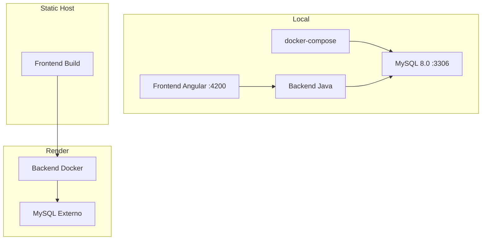

# Docker & Deployment

> Contenedores Docker y deployment a Render

---

## Dockerfile (Backend)

**Archivo**: `backend/Dockerfile`

Multi-stage build para minimizar el tamano de la imagen final.

```dockerfile
# Build stage - compila con Maven
FROM maven:3.9.6-eclipse-temurin-21-jammy AS build
WORKDIR /app
COPY pom.xml .
COPY src ./src
RUN mvn clean package -DskipTests

# Run stage - solo el JRE
FROM eclipse-temurin:21-jre-jammy
WORKDIR /app
COPY --from=build /app/target/backend-0.0.1-SNAPSHOT.jar app.jar
EXPOSE 8080
ENTRYPOINT ["java", "-jar", "app.jar"]
```

### Etapas

| Etapa | Imagen Base | Proposito | Tamano |
|-------|-------------|-----------|--------|
| `build` | `maven:3.9.6-eclipse-temurin-21-jammy` | Compilar el JAR | ~800MB |
| `run` | `eclipse-temurin:21-jre-jammy` | Ejecutar la app | ~300MB |

La etapa de build se descarta, reduciendo la imagen final significativamente.

---

## Docker Compose

**Archivo**: `docker-compose.yml`

Solo levanta la base de datos MySQL. El backend se ejecuta localmente.

```yaml
version: '3.8'

services:
  db:
    image: mysql:8.0
    container_name: pokefetch-db
    environment:
      MYSQL_ALLOW_EMPTY_PASSWORD: "yes"
      MYSQL_DATABASE: pokemon_tcg
    ports:
      - "3306:3306"
    volumes:
      - db_data:/var/lib/mysql

volumes:
  db_data:
```

### Uso

```bash
# Levantar MySQL
docker-compose up -d

# Ver logs
docker-compose logs -f db

# Detener
docker-compose down

# Detener y borrar datos
docker-compose down -v
```

---

## Deployment a Render

El proyecto esta deployado en **Render** (PaaS). La URL de produccion es:

```
https://pokemontcg-gi68.onrender.com
```

### Configuracion en Render

| Setting | Valor |
|---------|-------|
| **Build Command** | `cd backend && mvn clean package -DskipTests` |
| **Start Command** | `java -jar backend/target/backend-0.0.1-SNAPSHOT.jar` |
| **Runtime** | Docker (usa el Dockerfile) |
| **Region** | Oregon (US West) |

### Variables de Entorno en Render

Configurar en el dashboard de Render:

| Variable | Valor |
|----------|-------|
| `PORT` | Asignado automaticamente por Render |
| `DB_URL` | URL del servicio MySQL externo |
| `DB_USERNAME` | Usuario de la BD en produccion |
| `DB_PASSWORD` | Password de la BD en produccion |
| `MAIL_ENABLED` | `true` |
| `MAIL_USERNAME` | Email del remitente |
| `MAIL_PASSWORD` | App Password de Gmail |
| `FRONTEND_RESET_URL` | URL del frontend en produccion |

---

## Frontend Deployment

El frontend Angular se puede deployar en cualquier servicio de hosting estatico:

```bash
# Build de produccion
cd frontend
npm run build

# Output en dist/frontend/
```

El build genera archivos estaticos en `dist/frontend/` que se sirven desde cualquier CDN o servidor web (Netlify, Vercel, Render Static Site, etc.).

---

## Build Local del Backend con Docker

```bash
# Construir imagen
cd backend
docker build -t pokemon-tcg-backend .

# Ejecutar
docker run -p 8080:8080 \
  -e DB_URL=jdbc:mysql://host.docker.internal:3306/pokemon_tcg \
  pokemon-tcg-backend
```

`host.docker.internal` permite que el contenedor acceda al MySQL que corre en el host.

---

## Diagrama de Deployment


