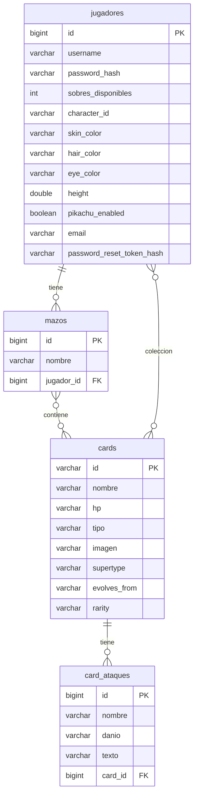
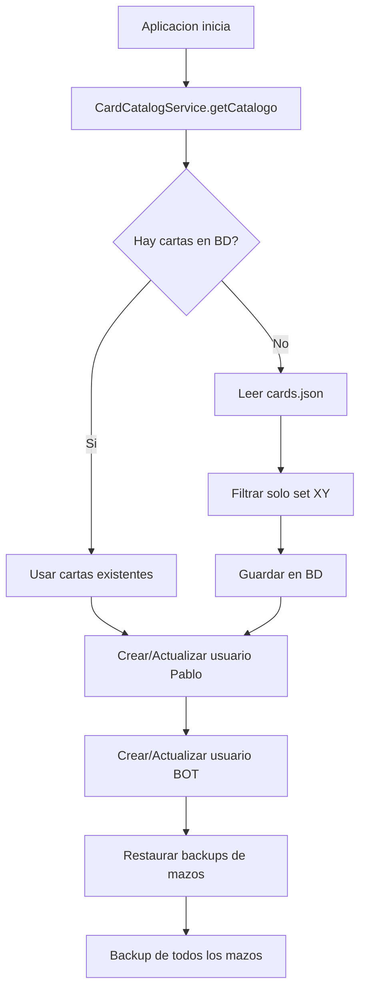

# Base de Datos - Setup y Esquema

> MySQL con esquema auto-generado por Hibernate y seed automatico de datos

---

## Motor de Base de Datos

| Entorno | Motor | Configuracion |
|---------|-------|---------------|
| **Desarrollo** | MySQL 8.0 (via Docker) | `docker-compose up -d` |
| **Produccion** | MySQL (servicio externo) | Variable `DB_URL` en Render |

El proyecto usa **MySQL** como base de datos principal. H2 esta disponible como dependencia pero la configuracion por defecto apunta a MySQL.

---

## Esquema Auto-Generado

El esquema se crea automaticamente con `spring.jpa.hibernate.ddl-auto=update`. Hibernate genera las tablas a partir de las anotaciones JPA.

### Tablas Generadas



### Entidades JPA

| Entidad | Tabla | Clave Primaria |
|---------|-------|----------------|
| `Jugador` | `jugadores` | `Long id` (auto-generated) |
| `Card` | `cards` | `String id` (ej: "xy1-1") |
| `Mazo` | `mazos` | `Long id` (auto-generated) |
| `Ataque` | `card_ataques` | `Long id` (auto-generated) |

---

## Seed de Datos (DataLoader)

**Archivo**: `config/DataLoader.java`

Al iniciar la aplicacion, `DataLoader` ejecuta automaticamente:



### Usuarios Seed

| Usuario | Password Hash | Sobres | Coleccion |
|---------|--------------|--------|-----------|
| `Pablo` | SHA-256 hardcodeado | 10 | 4x cada carta del catalogo |
| `BOT` | Mismo hash | 10 | 4x cada carta del catalogo |

El usuario BOT tiene avatar predefinido (Ash, con colores de piel/pelo/ojos configurados).

### Mazo Por Defecto

Cada usuario seed recibe un mazo de 60 cartas:
- **40 Pokemon**: Aleatorios (sin EX ni MEGA), shuffled
- **20 Energias**: Cicladas del pool de energias disponibles

---

## Catalogo de Cartas (CardCatalogService)

**Archivo**: `service/CardCatalogService.java`

### Fuente de Datos

El catalogo se carga desde `resources/cards.json`, un archivo JSON con todas las cartas del TCG.

### Filtrado

Solo se cargan cartas del **set XY** (IDs que empiezan con "xy"):
- Pokemon (`supertype = "Pokemon"`)
- Energias (`supertype = "Energy"`)
- Se excluyen Trainers y otros supertypes

### Normalizacion de Energias

Las energias basicas del set XY (xy1-132 a xy1-140) se mapean a su tipo correcto:

| ID | Tipo |
|----|------|
| xy1-132 | Grass |
| xy1-133 | Fire |
| xy1-134 | Water |
| xy1-135 | Lightning |
| xy1-136 | Psychic |
| xy1-137 | Fighting |
| xy1-138 | Darkness |
| xy1-139 | Metal |
| xy1-140 | Fairy |

---

## Backup de Mazos (MazoBackupService)

**Archivo**: `service/MazoBackupService.java`

Sistema de backup en archivo JSON para proteger mazos ante reinicios de la BD.

### Backup

```java
backupAll()  // Serializa todos los mazos validos (60 cartas) a JSON
```

**Ruta por defecto**: `data/mazos-backup.json`

Formato del backup:
```json
[
  {
    "username": "Pablo",
    "nombre": "Mazo Inicial Pablo",
    "cartas": ["xy1-1", "xy1-2", "..."]
  }
]
```

### Restauracion

```java
restoreMissingDecks()  // Al iniciar, restaura mazos que ya no existen en BD
```

Solo restaura si:
- El archivo de backup existe
- El jugador existe en BD
- No tiene ya un mazo con ese nombre
- Las 60 cartas existen en el catalogo

---

## Consola H2 (Alternativa)

Si se configura H2 en lugar de MySQL (cambiando `application.properties`):

```properties
spring.datasource.url=jdbc:h2:mem:pokemontcg
spring.datasource.driver-class-name=org.h2.Driver
spring.jpa.database-platform=org.hibernate.dialect.H2Dialect
```

Acceso a la consola web: `http://localhost:8080/h2-console`
