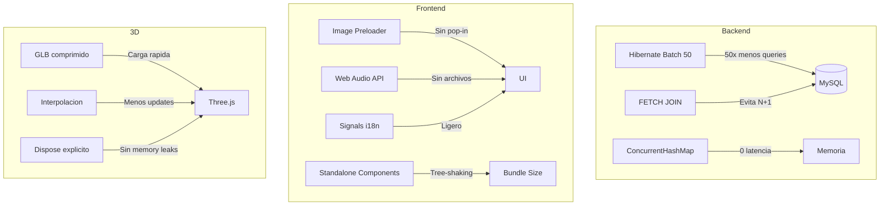

# Performance Tips

> Optimizaciones implementadas y recomendaciones de rendimiento

---

## Backend

### Batch de Hibernate

Configurado en `application.properties`:

```properties
spring.jpa.properties.hibernate.jdbc.batch_size=50
spring.jpa.properties.hibernate.order_inserts=true
spring.jpa.properties.hibernate.order_updates=true
```

| Setting | Efecto |
|---------|--------|
| `batch_size=50` | Agrupa hasta 50 operaciones SQL en un solo roundtrip |
| `order_inserts` | Reordena inserts por tabla para maximizar batching |
| `order_updates` | Idem para updates |

**Impacto**: El `DataLoader` carga cientos de cartas. Sin batching, cada carta seria un INSERT individual. Con batch_size=50, se reducen los roundtrips a la BD ~50x.

### FETCH JOIN en Repositorios

```java
@Query("SELECT j FROM Jugador j LEFT JOIN FETCH j.coleccion WHERE j.username = :username")
Jugador findByUsername(@Param("username") String username);
```

Evita el problema **N+1**: sin FETCH JOIN, cargar un jugador con 400+ cartas en su coleccion generaria 401 queries. Con FETCH JOIN, es una sola query.

### Almacenamiento In-Memory

Las partidas activas y salas del lobby se almacenan en `ConcurrentHashMap`:

```java
private final ConcurrentHashMap<String, Partida> partidasActivas;
private final ConcurrentHashMap<String, LobbyRoom> rooms;
```

**Ventaja**: Cero latencia de BD para operaciones de batalla en tiempo real.
**Tradeoff**: Los datos se pierden si el servidor reinicia.

---

## Frontend

### Image Preloading

`ImagePreloaderService` precarga imagenes antes de mostrar la UI:

```typescript
preloadImages(urls: string[]): Observable<number>  // Emite 0-100%
```

- Precarga hasta **18 imagenes unicas** al abrir el Deck Builder
- Usa elementos `Image()` del DOM para forzar la cache del navegador
- Cuenta errores como exitosos para no bloquear la UI

**Impacto**: Elimina el efecto "pop-in" donde las cartas aparecen sin imagen y luego se cargan de golpe.

### Web Audio API (Sonido Procedural)

`SoundService` genera sonidos directamente con `AudioContext` en vez de cargar archivos de audio:

```typescript
private ctx: AudioContext | null = null;
private masterGain: GainNode | null = null;  // 35% por defecto
```

**Ventaja**: Cero archivos de audio que descargar. Los efectos son instantaneos.

### Angular Standalone Components

Todos los componentes usan `standalone: true`:

```typescript
@Component({
  standalone: true,
  imports: [CommonModule, FormsModule]
})
```

**Ventaja**: Cada componente declara sus dependencias explicitamente. Angular puede hacer tree-shaking mas agresivo, eliminando codigo no usado del bundle final.

### Angular Signals (i18n)

El sistema de traduccion usa **Signals** en vez de Observables:

```typescript
// I18nService usa signal() internamente
// TranslatePipe es impure para reaccionar a cambios
```

**Ventaja**: Signals son mas ligeros que Observables para estado sincronico. El cambio de idioma se propaga instantaneamente sin subscripciones.

---

## Three.js (3D)

### Lobby 3D

Optimizaciones del lobby con Three.js:

| Tecnica | Descripcion |
|---------|-------------|
| **Modelo GLB** | Modelos 3D comprimidos y optimizados |
| **Interpolacion** | Posiciones de otros jugadores se interpolan, no se actualizan frame a frame |
| **Dispose en OnDestroy** | `renderer.dispose()` y `cancelAnimationFrame()` al destruir el componente |

### Apertura de Sobres

El componente `AperturaSobreComponent` usa:
- **Particulas limitadas**: Efecto de explosion con cantidad controlada de particulas
- **Luz puntual temporal**: La luz de explosion se crea y destruye, no persiste
- **Dispose explicito**: Toda la escena Three.js se limpia en `ngOnDestroy`

---

## Base de Datos

### Indices Recomendados

Hibernate genera indices para las PKs automaticamente. Para mejor performance en produccion:

```sql
-- Username es el campo de busqueda mas frecuente
CREATE INDEX idx_jugador_username ON jugadores(username);

-- Email para login y recovery
CREATE INDEX idx_jugador_email ON jugadores(email);

-- Mazos por jugador
CREATE INDEX idx_mazo_jugador ON mazos(jugador_id);
```

### DDL Auto en Produccion

En produccion, cambiar de `update` a `validate` para evitar modificaciones accidentales del esquema:

```properties
spring.jpa.hibernate.ddl-auto=validate
```

---

## Build Size

### Budget del Frontend

Configurado en `angular.json`:

```json
{
  "budgets": [
    {
      "type": "initial",
      "maximumWarning": "4mb",
      "maximumError": "5mb"
    }
  ]
}
```

El bundle inicial no debe superar 4MB (warning) ni 5MB (error). Three.js es la dependencia mas pesada (~600KB minified).

---

## Resumen de Optimizaciones


